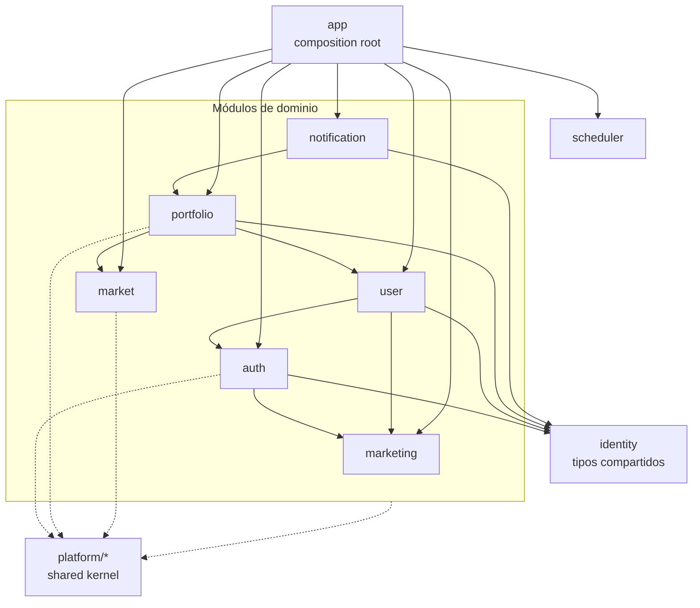

# Arquitectura del backend — Finexia

> Estado final de la migración descrita en
> [`ARCHITECTURE_MIGRATION.md`](./ARCHITECTURE_MIGRATION.md). Este documento
> describe **cómo está organizado el backend hoy** y las **reglas de
> dependencia** que lo mantienen así. El contrato HTTP vive en
> [`API.md`](./API.md); la deuda técnica pendiente, en
> [`TECH_DEBT.md`](./TECH_DEBT.md).

## 1. En una frase

Un **monolito modular organizado por dominios**: cada dominio es un paquete
autocontenido (dominio → servicio → repositorio → handler + rutas) que solo
depende del *shared kernel* técnico (`platform/`), de un paquete hoja de tipos
compartidos (`identity/`) y de las **interfaces públicas** de otros módulos.
No existen paquetes "por capa técnica" globales (`services/`, `handlers/`,
`repositories/`…): fueron eliminados en la Fase 8.

## 2. Estructura

```
backend/
├── cmd/api/main.go              # crea infraestructura y llama a app.New(...).Run(ctx)
└── internal/
    ├── app/                     # composition root: único lugar que cablea módulos,
    │                            # registra rutas y arranca el scheduler
    ├── platform/                # shared kernel técnico (sin lógica de negocio)
    │   ├── config/  logger/  database/  cache/  objectstore/
    │   ├── mail/  geoip/  httpx/         # httpx: middlewares genéricos + envelope de respuesta
    │   ├── spreadsheet/                  # lectura genérica de CSV/XLSX (compartida por los importers)
    │   └── marketdata/                   # provider de precios + alphavantage/finnhub/yahoo + fallback
    ├── identity/                # tipos compartidos (User, Account, Session, Role) — sin lógica
    │
    ├── auth/                    # login, sesiones, refresh, 2FA, verificación de email,
    │                            # password reset, invitaciones, middlewares JWT/RBAC
    ├── user/                    # perfil, preferencias, avatar (S3), administración
    ├── portfolio/               # portfolios, entries, transacciones, plataformas,
    │                            # snapshots, import/export (lee exchange-rates para conversión)
    ├── market/                  # catálogo de assets, exchange rates y sincronización de precios
    ├── marketing/               # waitlist
    ├── notification/            # resumen semanal por email
    │
    ├── scheduler/               # runner genérico Job/Scheduler.Register
    ├── health/                  # health check
    └── migrations/ migrator/    # esquema SQL (global) + runner
```

### Anatomía de un módulo

Cada módulo de dominio expone una superficie mínima y sigue el mismo patrón:

| Archivo | Rol |
|---|---|
| `module.go` | `New(Deps) *Module`, `Service() *Service`, `Routes(router)` |
| `domain.go` / `dto.go` | entidades del dominio y DTOs request/response |
| `repository.go` | interfaz(es) de persistencia **definidas por el consumidor** |
| `postgres.go` | implementación pgx de esa interfaz |
| `service.go` / `service_*.go` | casos de uso |
| `handler.go` | handlers HTTP (delegan en el service) |
| `*_test.go` | tests con fakes locales de las interfaces del módulo |

Un módulo nuevo se añade creando su paquete y registrándolo en `internal/app`
(un único punto de cableado).

## 3. Reglas de dependencia

1. **`platform/*` no conoce el negocio.** No importa ningún módulo de dominio ni
   `identity`. Es el kernel técnico reutilizable.
2. **`identity/` es una hoja.** No importa ningún otro paquete interno; solo
   contiene structs compartidos por auth, user, portfolio y notification.
3. **Un módulo solo importa `platform/`, `identity/` y las interfaces/tipos
   públicos de otros módulos** — nunca los internals de otro (no hay `postgres`
   de un módulo importado por otro).
4. **Las interfaces las define el consumidor.** Cuando `portfolio` necesita
   datos de `user`, declara `portfolio.UserReader` y `app` le inyecta
   `user.Service`. Las interfaces se mantienen pequeñas y cohesivas (ej.:
   `auth.Stores` = 5 stores; `portfolio.Repository` = unión de 5 sub-stores).
5. **`internal/app` es el único que cablea.** Ningún módulo importa `app`; el
   flujo de dependencias va siempre de `app` hacia abajo.
6. **La API HTTP no cambia** respecto a lo documentado en `API.md`.

### Grafo de dependencias entre módulos



El grafo es acíclico (el compilador de Go ya lo garantiza) y respeta las reglas
anteriores. El catálogo de assets (tipo `Asset`, persistencia, servicio, import)
y los exchange-rates son propiedad de `market`; `portfolio` referencia
`market.Asset` en sus entries y lee el catálogo a través de su interfaz local
`AssetReader` (implementada por `market`), de modo que la dependencia va
`portfolio → market`. `portfolio` conserva solo una lectura de exchange-rates
para convertir a la divisa de visualización.

## 4. Blindaje automatizado

Las reglas 1, 2 y 5 se verifican en CI mediante un **arch-test**
(`internal/app/arch_test.go`), que parsea los imports de cada paquete interno y
falla ante una violación:

- `TestPlatformStaysAKernel` — `platform/*` no importa dominios ni `identity`.
- `TestIdentityStaysALeaf` — `identity` no importa nada interno.
- `TestNothingImportsCompositionRoot` — ningún módulo importa `internal/app`.

(Se prefirió a `depguard`, deshabilitado por problemas de configuración; ver el
comentario en `.golangci.yml`.)

## 5. Composition root y arranque

`cmd/api/main.go` solo crea la infraestructura (pool pgx, cache, S3, mail,
logger, env) y llama a `app.New(deps).Run(ctx)`. `internal/app`:

1. construye el provider de precios (fallback alphavantage→finnhub→yahoo),
2. construye cada módulo con sus dependencias (incluyendo las interfaces
   módulo→módulo, p. ej. `portfolio` recibe `user.Service` como `UserReader`),
3. registra las rutas: primero las públicas y los grupos con guard propio
   (`auth`, `auth.AdminRoutes`), luego el resto de módulos y por último las
   rutas bajo el gate global,
4. registra todos los cron jobs en el `scheduler.Scheduler` genérico
   (`auth.CleanupJob`, `portfolio.SnapshotJob`,
   `market.{AssetPrice,ExchangeRate}Scheduler`,
   `notification.WeeklySummaryScheduler`).

## 6. Cobertura de tests

Medición tras la revisión de cierre (`go test ./... -coverprofile`),
**total 39.4%** (línea base de Fase 0: 42.6%, sobre un layout distinto en el que
`repositories/`, `routes/` y `scheduler/` eran paquetes separados al 0%):

| Módulo | Cobertura | Notas |
|---|---|---|
| `notification` | 81.8% | servicio puro, bien cubierto |
| `platform/spreadsheet` | 72.4% | parser de importación compartido |
| `auth` | 45.5% | núcleo de sesiones/2FA/verificación |
| `market` | 40.1% | catálogo de assets + exchange rates + sync |
| `portfolio` | 38.9% | servicio + handlers HTTP; `postgres.go` sin tests unitarios |
| `marketing` | 40.0% | |
| `user` | 11.2% | capa HTTP mayormente sin tests (deuda) |
| `platform/marketdata*`, `config`, `database`, `geoip` | 80–100% | |

Los `postgres.go` de cada módulo no tienen tests unitarios (requieren Postgres
real); se propone integración con testcontainers en `TECH_DEBT.md` #4/#11. La
capa HTTP de `user` es la mayor brecha pendiente.
