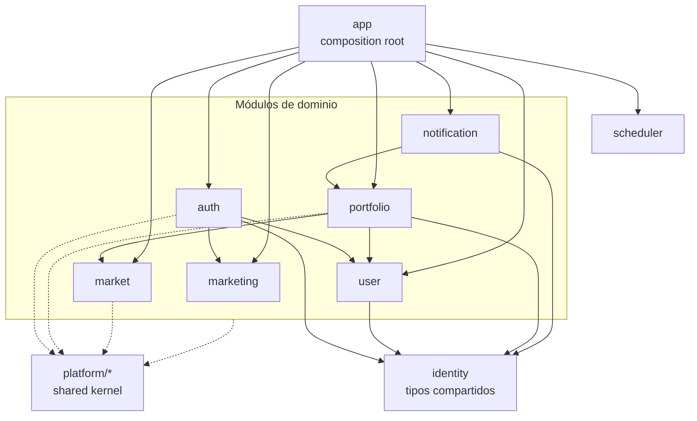

# Arquitectura del backend — Finexia

> Estado final de la migración descrita en
> [`ARCHITECTURE_MIGRATION.md`](./ARCHITECTURE_MIGRATION.md). Este documento
> describe **cómo está organizado el backend hoy** y las **reglas de
> dependencia** que lo mantienen así. El contrato HTTP vive en
> [`API.md`](./API.md); la deuda técnica pendiente, en
> [`TECH_DEBT.md`](./TECH_DEBT.md).

## 1. En una frase

Un **monolito modular organizado por dominios**: cada dominio es un paquete
autocontenido (dominio → servicio → repositorio → handler + rutas) que solo
depende del *shared kernel* técnico (`platform/`), de un paquete hoja de tipos
compartidos (`identity/`) y de las **interfaces públicas** de otros módulos.
No existen paquetes "por capa técnica" globales (`services/`, `handlers/`,
`repositories/`…): fueron eliminados en la Fase 8.

## 2. Estructura

```
backend/
├── cmd/api/main.go              # crea infraestructura y llama a app.New(...).Run(ctx)
└── internal/
    ├── app/                     # composition root: único lugar que cablea módulos,
    │                            # registra rutas y arranca el scheduler
    ├── platform/                # shared kernel técnico (sin lógica de negocio)
    │   ├── config/  logger/  database/  cache/  objectstore/
    │   ├── mail/  geoip/  httpx/         # httpx: middlewares genéricos + envelope de respuesta
    │   ├── spreadsheet/                  # lectura genérica de CSV/XLSX (compartida por los importers)
    │   ├── marketdata/                   # provider de precios (BYO-key) + alphavantage/finnhub + fallback + providers/
    │   └── secretbox/                    # cifrado de sobre de las claves que aportan los usuarios
    ├── identity/                # tipos compartidos (User, Account, Session, Role) — sin lógica
    │
    ├── auth/                    # login, sesiones, refresh, 2FA, verificación de email,
    │                            # password reset, invitaciones, middlewares JWT/RBAC
    ├── user/                    # perfil, preferencias, avatar (S3), administración
    ├── portfolio/               # portfolios, entries, transacciones, plataformas,
    │                            # snapshots, import/export (lee exchange-rates para conversión)
    ├── market/                  # catálogo de assets, exchange rates, claves BYO-key y sync por usuario
    ├── marketing/               # waitlist
    ├── notification/            # resumen semanal por email
    │
    ├── scheduler/               # runner genérico Job/Scheduler.Register
    ├── health/                  # health check
    └── migrations/ migrator/    # esquema SQL (global) + runner
```

### Anatomía de un módulo

Cada módulo de dominio expone una superficie mínima y sigue el mismo patrón:

| Archivo | Rol |
|---|---|
| `module.go` | `New(Deps) *Module`, `Service() *Service`, `Routes(router)` |
| `domain.go` / `dto.go` | entidades del dominio y DTOs request/response |
| `repository.go` | interfaz(es) de persistencia **definidas por el consumidor** |
| `postgres.go` | implementación pgx de esa interfaz |
| `service.go` / `service_*.go` | casos de uso |
| `handler.go` | handlers HTTP (delegan en el service) |
| `*_test.go` | tests con fakes locales de las interfaces del módulo |

Un módulo nuevo se añade creando su paquete y registrándolo en `internal/app`
(un único punto de cableado).

## 3. Reglas de dependencia

1. **`platform/*` no conoce el negocio.** No importa ningún módulo de dominio ni
   `identity`. Es el kernel técnico reutilizable. Ahí vive también la convención
   de identidad en los locals de la request (`httpx.LocalUserID`/`LocalToken`/
   `LocalRole` y el accesor `httpx.Identity`): el middleware de `auth` la
   escribe y los handlers de todos los módulos la leen, pero mover la identidad
   por la request es transporte, no dominio. Antes esas tres constantes y su
   accesor estaban copiados en `auth`, `user` y `portfolio` (y la clave, una
   cuarta vez, en `app`), de modo que cambiar la convención obligaba a acertar
   en cuatro sitios a la vez.
2. **`identity/` es una hoja.** No importa ningún otro paquete interno; solo
   contiene structs compartidos por auth, user, portfolio y notification.
3. **Un módulo solo importa `platform/`, `identity/` y las interfaces/tipos
   públicos de otros módulos** — nunca los internals de otro (no hay `postgres`
   de un módulo importado por otro).
4. **Las interfaces las define el consumidor.** Cuando `portfolio` necesita
   datos de `user`, declara `portfolio.UserReader` y `app` le inyecta
   `user.Service`. Las interfaces se mantienen pequeñas y cohesivas (ej.:
   `auth.Stores` = 5 stores; `portfolio.Repository` = unión de 5 sub-stores).
5. **El grafo de módulos es acíclico y todo se inyecta por constructor.** No hay
   setters ni slots que queden `nil` un rato: si un módulo necesita algo, lo
   recibe en su `New`. Eso obliga a un orden de construcción, descrito abajo.
6. **Cada módulo declara su propia `Config`.** Ninguno importa
   `platform/config`: `app` proyecta el `*config.Env` sobre `auth.Config`,
   `user.Config`, `portfolio.Config` y `notification.Config` (`market` no
   necesita ninguna). Lo fija `TestModulesOwnTheirConfig`.
7. **`internal/app` es el único que cablea.** Ningún módulo importa `app`; el
   flujo de dependencias va siempre de `app` hacia abajo.
8. **La API HTTP no cambia** respecto a lo documentado en `API.md`.

### Grafo de dependencias entre módulos


```mermaid
graph TD
    app[app<br/>composition root]
    subgraph domain[Módulos de dominio]
        auth --> marketing
        auth --> user
        portfolio --> user
        portfolio --> market
        notification --> portfolio
    end
    identity[identity<br/>tipos compartidos]
    platform[platform/*<br/>shared kernel]

    app --> auth
    app --> user
    app --> portfolio
    app --> market
    app --> marketing
    app --> notification
    app --> scheduler

    auth --> identity
    user --> identity
    portfolio --> identity
    notification --> identity

    auth -.-> platform
    portfolio -.-> platform
    market -.-> platform
    domain -.-> platform
```

El grafo es acíclico (el compilador de Go ya lo garantiza) y respeta las reglas
anteriores. El catálogo de assets (tipo `Asset`, persistencia, servicio, import)
y los exchange-rates son propiedad de `market`; `portfolio` referencia
`market.Asset` en sus entries y lee el catálogo a través de su interfaz local
`AssetReader` (implementada por `market`), de modo que la dependencia va
`portfolio → market`. `portfolio` conserva solo una lectura de exchange-rates
para convertir a la divisa de visualización.

La sincronización BYO-key necesita el sentido contrario —saber qué activos
tiene un usuario para no gastar su cuota personal en el catálogo entero— y eso
habría cerrado un ciclo. Se resuelve con la regla de siempre: `market` declara
la interfaz `Holdings` que necesita y `portfolio` la implementa
(`portfolio/holdings.go`). El grafo sigue siendo `portfolio → market`.

### Orden de construcción

El grafo de arriba es también el orden en que `internal/app` construye. Cuatro
módulos (`user`, `market`, `portfolio`, `marketing`) necesitan los guards
`RequireAuth`/`RequireAdmin` que expone `auth.Module`, y `auth` a su vez lee
`user` (tablas users/roles) y `marketing` (waitlist). Para que eso no sea un
ciclo, `user` y `marketing` se construyen **en dos pasos**:

```go
marketingService := marketing.NewService(...)   // no depende de ningún dominio
userService      := user.NewService(...)        // idem
authModule       := auth.New(auth.Deps{Users: userService, Waitlist: marketingService, ...})
marketingModule  := marketing.New(marketing.Deps{Service: marketingService, AuthMiddl: authModule, ...})
userModule       := user.New(user.Deps{Service: userService, AuthMiddl: authModule, ...})
// market, portfolio y notification después, todos con authModule ya disponible
```

`NewService` construye los casos de uso a partir de infraestructura sola;
`New` completa el módulo con su superficie HTTP y los guards. Lo que hace que
el primer paso sea posible es que **`user` y `marketing` no importan ningún
otro módulo de dominio** — invariante que fija
`TestServiceFirstModulesStayIndependent`. Si alguno de los dos ganara una
dependencia hacia `auth`, el grafo volvería a ser cíclico y el cableado
necesitaría un setter.

Por eso hay rutas que responden bajo `/users` sin pertenecer al módulo `user`:
`PATCH /users/me/password` y `/users/invitations*` son de `auth` (credenciales
e invitaciones son su dominio) y `GET /users/waitlist` es de `marketing`. Los
paths no cambian —son los que documenta `API.md`—; lo que cambia es qué módulo
los sirve. Al ser rutas terminales fuera del grupo `/users`, aplican los guards
ellas mismas, y `mountRoutes` monta `auth` y `marketing` antes que `user` para
que `GET/PATCH /users/:id` no las capture. `TestAppWiresAndRoutes` verifica ese
orden.

### Datos de mercado: BYO-key

La aplicación no guarda credenciales de ningún proveedor de datos de mercado.
Cada usuario aporta la suya, y eso impone dos invariantes que atraviesan varios
módulos:

**La clave no se puede recuperar de la base de datos.** Se sella con cifrado de
sobre en `platform/secretbox`: una DEK aleatoria por credencial, envuelta bajo
una KEK que vive en el entorno (`MARKET_KEK_KEYS`) y nunca en Postgres. El AAD
ata cada secreto a su dueño y proveedor, así que copiar un ciphertext a la fila
de otro usuario no lo hace legible: escribir en la tabla no da acceso a la
clave de nadie. La KEK admite varias versiones a la vez y `Rewrap` rota
re-envolviendo solo la DEK, sin volver a pedir nada a los usuarios. El proceso
no arranca sin KEK, deliberadamente.

**El dato que trae una clave es de quien la puso.** Los ToS de los proveedores
no permiten redistribuir datos de un plan personal, así que precios y tasas van
a `user_asset_prices` / `user_exchange_rates`, y la valoración (`portfolio` y
la vista `portfolio_summary`) prefiere el dato del propio usuario, luego el
precio manual del operador, y por último su coste de compra — nunca el dato de
otro usuario.

De ahí se sigue lo demás: los clientes de proveedor se construyen por ejecución
(`marketdata.Factory`, implementada en `marketdata/providers`) en vez de una
vez al arrancar, y todo error de proveedor pasa por `marketdata.Errorf`, que
depura la clave del mensaje — Alpha Vantage solo la acepta en el query string y
los errores de transporte de Go citan la URL completa.

## 4. Blindaje automatizado

Las reglas 1, 2 y 5 se verifican en CI mediante un **arch-test**
(`internal/app/arch_test.go`), que parsea los imports de cada paquete interno y
falla ante una violación:

- `TestPlatformStaysAKernel` — `platform/*` no importa dominios ni `identity`.
- `TestIdentityStaysALeaf` — `identity` no importa nada interno.
- `TestNothingImportsCompositionRoot` — ningún módulo importa `internal/app`.

(Se prefirió a `depguard`, deshabilitado por problemas de configuración; ver el
comentario en `.golangci.yml`.)

## 5. Composition root y arranque

`cmd/api/main.go` solo crea la infraestructura (pool pgx, cache, S3, mail,
logger, env) y llama a `app.New(deps).Run(ctx)`. `internal/app`:

1. construye la fábrica de proveedores de datos de mercado
   (`marketdata/providers`), que **no** lleva ninguna clave: cada ejecución de
   sync arma su cadena con las claves del usuario que la origina, en el orden
   `finnhub → alphavantage` (`marketdata.SupportedProviders`),
2. construye cada módulo con sus dependencias (incluyendo las interfaces
   módulo→módulo, p. ej. `portfolio` recibe `user.Service` como `UserReader`),
3. registra las rutas: primero las públicas y los grupos con guard propio
   (`auth`, `auth.AdminRoutes`), luego el resto de módulos y por último las
   rutas bajo el gate global,
4. registra todos los cron jobs en el `scheduler.Scheduler` genérico
   (`auth.CleanupJob`, `portfolio.SnapshotJob`, `market.SyncJob`,
   `notification.WeeklySummaryScheduler`).

`market.SyncJob` sustituyó a los dos jobs globales de precios y tasas: sin
clave de operador no hay nada global que sincronizar, así que recorre los
usuarios que tienen clave propia y sincroniza cada uno con la suya.

Ese job es también el único registrado con política de reintento propia
(`scheduler.WithRetry`). El timeout por defecto del runner son 30 s, pero el
sync espacia sus llamadas para caber en las cuotas gratuitas personales —13 s
entre dos peticiones a Alpha Vantage—, así que un solo usuario con unas pocas
posiciones ya lo excede. Se le da 2 h y cero reintentos: repetir un intento
vuelve a gastar la cuota que el primero ya consumió, y los fallos por usuario se
cuentan dentro del job en vez de propagarse.

`portfolio.SnapshotJob` corre por la noche, no escalonado tras la apertura de
mercado: bajo el modelo anterior un job global refrescaba todos los precios en
segundos, mientras que el sync BYO-key puede tardar horas, y un snapshot tomado
dos minutos después de la apertura registraría los valores de ayer.

## 6. Cobertura de tests

Medición tras el cierre de los cabos sueltos de BYO-key
(`go test ./... -coverprofile`), **total 55.8%** (línea base de Fase 0: 42.6%,
sobre un layout distinto en el que `repositories/`, `routes/` y `scheduler/`
eran paquetes separados al 0%):

| Módulo | Cobertura | Notas |
|---|---|---|
| `scheduler` (+ `fiberstore`) | 98.5% / 95.8% | runner y cadencias |
| `platform/marketdata` (+ `providers`, clientes) | 82–100% | incluye los tests de no-fuga de la clave |
| `platform/secretbox` | 86.0% | cifrado de sobre, AAD y rotación de KEK |
| `notification` | 80.0% | servicio puro, bien cubierto |
| `platform/spreadsheet` | 72.4% | parser de importación compartido |
| `portfolio` | 63.6% | servicio + handlers HTTP; `postgres.go` sin tests unitarios |
| `app` | 62.9% | cableado y registro de rutas/jobs |
| `market` | 53.2% | catálogo, exchange rates, sync y credenciales BYO-key |
| `auth` | 48.1% | núcleo de sesiones/2FA/verificación |
| `marketing` | 48.3% | |
| `user` | 5.0% | capa HTTP mayormente sin tests (deuda) |

Los `postgres.go` de cada módulo no tienen tests unitarios (requieren Postgres
real); se propone integración con testcontainers en `TECH_DEBT.md` #4/#11. La
capa HTTP de `user` es la mayor brecha pendiente.

## 7. Variables de entorno

Referencia completa en `backend/.env.example`; se leen en
`platform/config/env.go`. Todas tienen un valor por defecto razonable para
desarrollo salvo las tres que el proceso necesita para existir: `DATABASE_URL`,
`JWT_SECRET` y `MARKET_KEK_KEYS`.

### `MARKET_KEK_KEYS` y `MARKET_KEK_ACTIVE`

Son las claves que envuelven las claves de proveedor de cada usuario. Formato:

```
MARKET_KEK_KEYS=1:<base64>,2:<base64>
MARKET_KEK_ACTIVE=2
```

- Lista separada por comas de entradas `versión:clave`. La versión es un entero
  decimal; la clave es base64 **estándar con padding** que debe decodificar a
  **exactamente 32 bytes** (AES-256). Se genera con `openssl rand -base64 32`.
- `MARKET_KEK_ACTIVE` nombra la versión bajo la que se sellan las credenciales
  nuevas, y tiene que ser una de las suministradas. Su valor por defecto es `1`.
- **El proceso no arranca sin ella** (`cmd/api/main.go`). Es deliberado: un
  valor por defecto significaría que todos los despliegues sellan las claves de
  sus usuarios bajo algo adivinable, y la propiedad que sostiene el modelo es
  justo que un volcado de Postgres no basta para recuperar ninguna clave —
  porque lo que las abre vive aquí, en el entorno.

**Rotación.** Se añade la versión nueva a la lista, se apunta
`MARKET_KEK_ACTIVE` a ella y se mantiene la vieja listada hasta que todas las
filas se hayan vuelto a envolver. `secretbox.Rewrap` re-envuelve solo la DEK de
cada credencial, así que rotar no obliga a pedir a los usuarios que vuelvan a
introducir sus claves. Hoy `Rewrap` no tiene todavía un comando de operador que
lo ejecute sobre la tabla; ver `TECH_DEBT.md`.

No hay —ni debe haber— ninguna variable con claves de proveedor de datos de
mercado. `ALPHA_VANTAGE_API_KEY` y `FINNHUB_API_KEY` desaparecieron con el
modelo BYO-key y ya no las lee nada.
