# Manual de Usuario — FINEXIA

**Versión del documento:** 1.2
**Fecha:** Julio 2026
**Aplicación:** Finexia — Plataforma de gestión y seguimiento de portafolios de inversión

---

## Tabla de contenido

1. [Introducción](#1-introducción)
2. [Requisitos y acceso](#2-requisitos-y-acceso)
3. [Primeros pasos: registro e inicio de sesión](#3-primeros-pasos-registro-e-inicio-de-sesión)
4. [Interfaz general de la aplicación](#4-interfaz-general-de-la-aplicación)
5. [Dashboard (panel principal)](#5-dashboard-panel-principal)
6. [Portafolios](#6-portafolios)
7. [Posiciones y activos](#7-posiciones-y-activos)
8. [Plataformas](#8-plataformas)
9. [Transacciones](#9-transacciones)
10. [Importación masiva de transacciones (Excel/CSV)](#10-importación-masiva-de-transacciones-excelcsv)
11. [Reportes y exportaciones](#11-reportes-y-exportaciones)
12. [Notificaciones](#12-notificaciones)
13. [Configuración de la cuenta](#13-configuración-de-la-cuenta)
14. [Seguridad: 2FA y sesiones](#14-seguridad-2fa-y-sesiones)
15. [Preguntas frecuentes (FAQ)](#15-preguntas-frecuentes-faq)
16. [Solución de problemas](#16-solución-de-problemas)
17. [Glosario](#17-glosario)

---

## 1. Introducción

### 1.1 ¿Qué es Finexia?

Finexia es una aplicación web para **gestionar y hacer seguimiento de tus portafolios de inversión** en un solo lugar. Te permite registrar tus activos (acciones, criptomonedas, ETFs, fondos y otros instrumentos), las plataformas donde los tienes, y todas tus transacciones de compra y venta, para luego visualizar el rendimiento, la distribución y el crecimiento de tu patrimonio con gráficas y reportes descargables.

### 1.2 Principios clave

- **Tú controlas tus datos.** Finexia **no se conecta a tus brokers ni a tus plataformas de inversión**, y nunca te pedirá las credenciales de esas cuentas. Toda la información se registra manualmente (o mediante importación de archivos Excel/CSV), por lo que siempre está bajo tu control.
- **Multi-portafolio.** Puedes crear tantos portafolios como necesites (por ejemplo: "Retiro", "Cripto", "Fondo de emergencia") y analizarlos de forma individual o agregada.
- **Multi-moneda.** Cada portafolio tiene una moneda base y la aplicación convierte automáticamente los valores entre monedas para mostrarte tu patrimonio consolidado.
- **Seguridad primero.** La aplicación incluye verificación de correo electrónico, autenticación en dos pasos (2FA), gestión de sesiones activas y protección contra intentos de acceso masivos.

---

## 2. Requisitos y acceso

### 2.1 Requisitos

- Un navegador web moderno y actualizado (Chrome, Firefox, Safari o Edge).
- Conexión a internet.
- Una dirección de correo electrónico válida (necesaria para verificar la cuenta y recuperar la contraseña).
- Opcional, pero recomendado: una aplicación de autenticación (Google Authenticator, Authy, 1Password, etc.) para activar la verificación en dos pasos.

La aplicación es **responsive**: funciona tanto en computadoras de escritorio como en tabletas y teléfonos móviles. En pantallas pequeñas el menú lateral se oculta y se abre con el botón de menú de la cabecera.

### 2.2 Página de inicio (landing) y lista de espera

Al visitar la dirección pública de Finexia sin haber iniciado sesión verás la página de presentación, con la descripción del producto, sus beneficios, preguntas frecuentes y las páginas legales (Términos, Privacidad y Cookies).

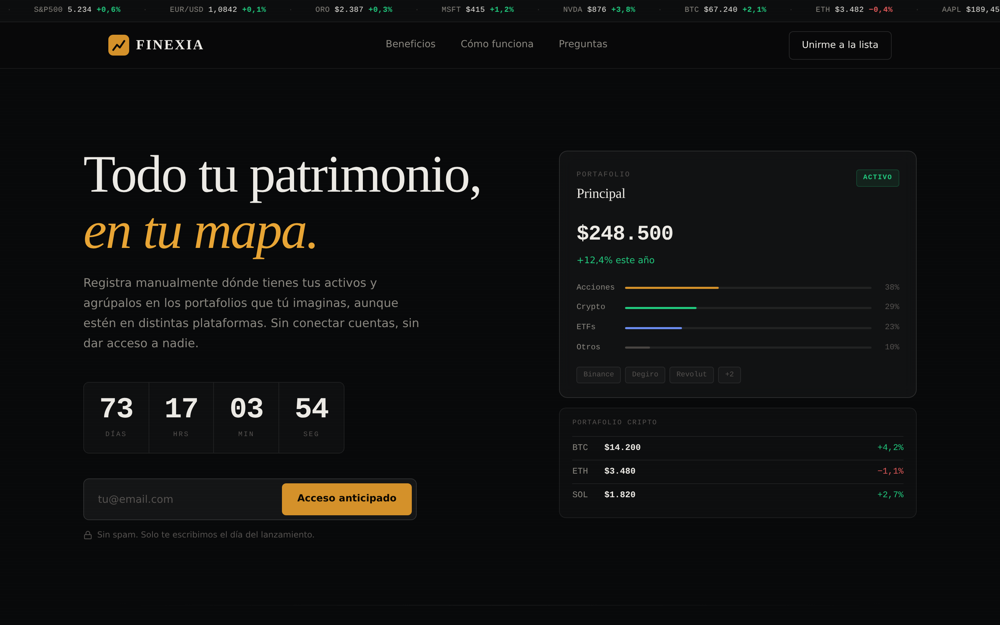

Si el registro directo no está habilitado, la página te ofrece unirte a la **lista de espera** dejando tu correo electrónico en el formulario de **"Acceso anticipado"**. El equipo de Finexia podrá luego enviarte una **invitación** para crear tu cuenta.

---

## 3. Primeros pasos: registro e inicio de sesión

### 3.1 Crear una cuenta

Existen dos vías para obtener una cuenta:

**A) Registro directo** (si está habilitado):

1. En la página de inicio, pulsa **Registrarse / Crear cuenta**.
2. Completa tus datos: nombre, correo electrónico y contraseña.
3. Envía el formulario. Recibirás un **correo de verificación**.
4. Abre el enlace del correo para **verificar tu dirección**. Sin este paso no podrás iniciar sesión (el sistema mostrará un aviso de "correo sin verificar").

> **Nota:** si el registro directo está desactivado, el formulario mostrará un aviso indicando que el registro está deshabilitado. En ese caso, únete a la lista de espera para recibir una invitación.

**B) Por invitación:**

1. Recibirás en tu correo una invitación para unirte a Finexia.
2. Abre el enlace **Aceptar invitación** del correo. La aplicación validará la invitación.
3. Define tu contraseña y confirma. Tu cuenta quedará creada y verificada, lista para iniciar sesión.

Las invitaciones tienen caducidad; si el enlace expiró, solicita que te la reenvíen.

### 3.2 Iniciar sesión

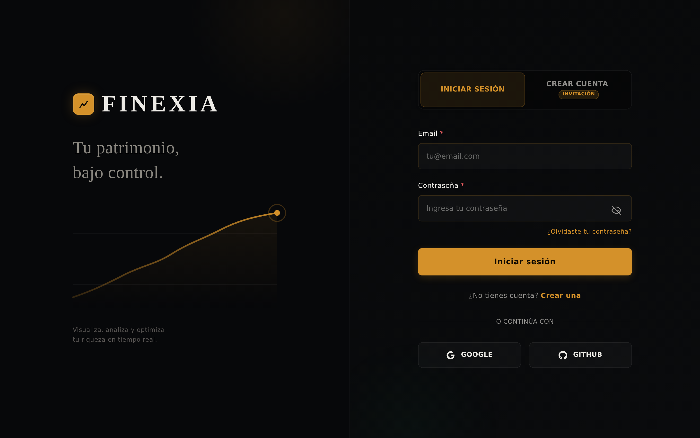

1. Ve a la página de **Iniciar sesión**.
2. Introduce tu correo y contraseña.
3. Si tienes **2FA activado**, la aplicación te pedirá un segundo paso: introduce el **código de 6 dígitos** de tu aplicación de autenticación (o uno de tus códigos de recuperación).
4. Al completar el acceso entrarás directamente al **Dashboard**.

La sesión se mantiene mediante un token de acceso de corta duración y una cookie segura de renovación que se rota automáticamente; no necesitas hacer nada para mantener la sesión activa mientras uses la aplicación.

### 3.3 ¿Olvidaste tu contraseña?

1. En la pantalla de inicio de sesión, pulsa **¿Olvidaste tu contraseña?**
2. Introduce tu correo electrónico. Si existe una cuenta asociada, recibirás un enlace de restablecimiento.
3. Abre el enlace, define tu **nueva contraseña** y confírmala.
4. Inicia sesión con la nueva contraseña.

Los enlaces de restablecimiento caducan por seguridad; si el tuyo expiró, solicita uno nuevo.

### 3.4 Verificación de correo

Si intentas iniciar sesión sin haber verificado tu correo, la aplicación te lo indicará y te permitirá **reenviar el correo de verificación**. Revisa también la carpeta de spam.

### 3.5 Cerrar sesión

Usa el botón **Cerrar Sesión** situado en la parte inferior de la barra lateral. También puedes cerrar sesiones abiertas en otros dispositivos desde **Configuración → Sesiones activas** (ver sección 14.3).

---

## 4. Interfaz general de la aplicación

Una vez dentro, la aplicación se organiza en tres zonas:

### 4.1 Cabecera (header)

Situada en la parte superior. Contiene:

- El botón de **menú** (en pantallas pequeñas) para mostrar/ocultar la barra lateral.
- Accesos rápidos y el indicador de **notificaciones**.
- Tu **avatar**, nombre y correo de la cuenta.

### 4.2 Barra lateral (menú principal)

Es el menú de navegación. Sus secciones son:

| Sección | ¿Para qué sirve? |
|---|---|
| **Dashboard** | Vista general: patrimonio neto, crecimiento y actividad reciente |
| **Portafolios** | Crear y gestionar tus portafolios y sus posiciones |
| **Plataformas** | Registrar los brokers/exchanges/bancos donde tienes activos |
| **Transacciones** | Historial de operaciones e importación desde Excel/CSV |
| **Reportes** | Estadísticas, calendario de rendimiento y descargas en Excel |
| **Notificaciones** | Preferencias de avisos por correo y en la app |
| **Configuración** | Perfil, apariencia, contraseña, 2FA y sesiones |

En la parte inferior de la barra lateral está el botón **Cerrar Sesión**.

### 4.3 Área de contenido

Es la zona central donde se muestra cada página. En la mayoría de listados encontrarás paginación y acciones contextuales (crear, editar, eliminar).

### 4.4 Uso en el móvil

La interfaz se adapta automáticamente a pantallas pequeñas: el contenido ocupa todo el ancho y la barra lateral queda oculta.

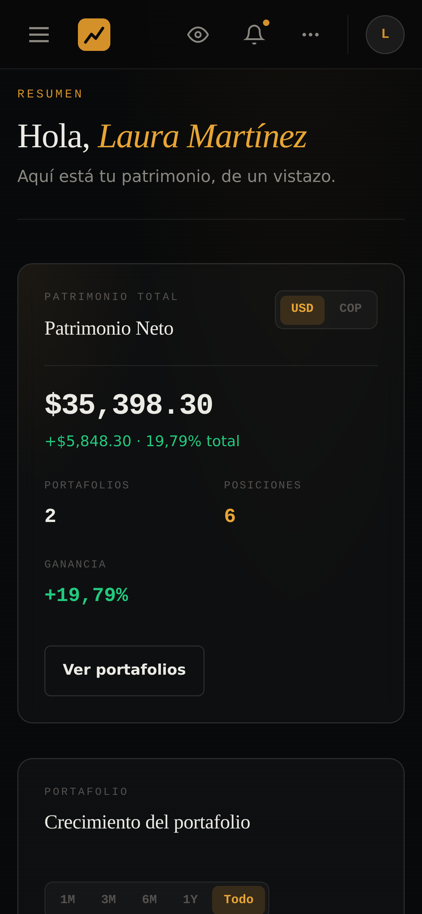

Para navegar, pulsa el **botón de menú** (las tres líneas de la esquina superior izquierda): la barra lateral se despliega con las mismas secciones que en escritorio y se cierra al elegir una opción o al tocar fuera de ella.

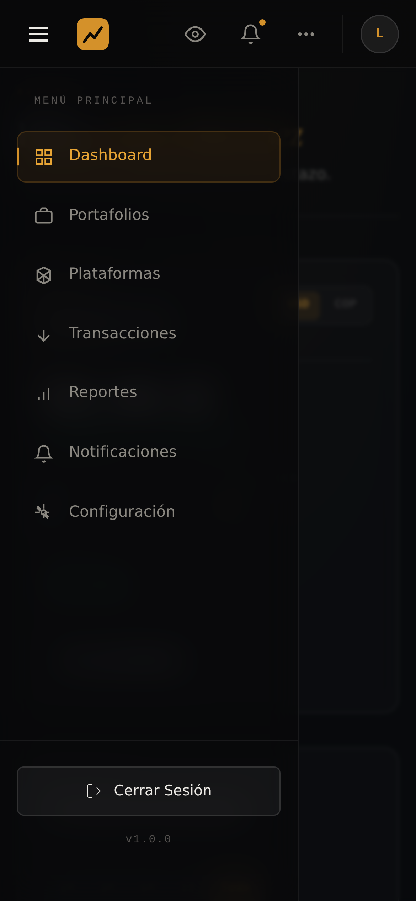

Todas las funciones descritas en este manual están disponibles también desde el móvil.

---

## 5. Dashboard (panel principal)

El Dashboard es la primera pantalla tras iniciar sesión y ofrece una fotografía general de tus finanzas.

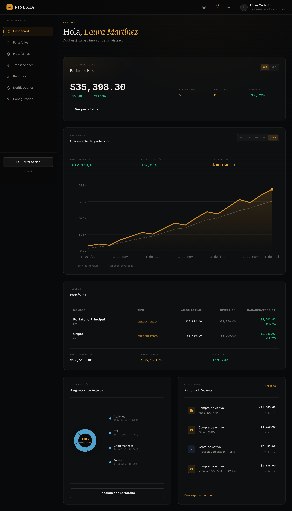

Sus bloques principales son:

- **Patrimonio Neto:** el valor total de todos tus portafolios, con la ganancia acumulada en importe y porcentaje, el número de portafolios y de posiciones. Con el selector de moneda (p. ej. **USD/COP**) puedes ver el total consolidado en la moneda que prefieras.
- **Crecimiento del portafolio:** gráfica de evolución de tu patrimonio que compara el **valor de mercado** con el **capital invertido**. Puedes cambiar el periodo mostrado (1M, 3M, 6M, 1Y o Todo) y ver la ganancia total, el crecimiento desde la creación y el valor actual.
- **Portafolios:** tabla resumen con cada portafolio, su tipo, valor actual, importe invertido y ganancia/pérdida (en verde si es positiva, en rojo si es negativa), junto con los totales.
- **Asignación de Activos:** gráfica de dona con la distribución porcentual de tu dinero entre tipos de activos (acciones, ETF, criptomonedas, fondos…).
- **Actividad Reciente:** las últimas compras y ventas registradas, con acceso a **Ver todo** y a **Descargar extracto**.

> **Consejo:** si acabas de crear tu cuenta, el Dashboard aparecerá vacío. Sigue este orden para empezar: (1) registra tus **Plataformas**, (2) crea un **Portafolio**, (3) añade **posiciones** y (4) registra o importa tus **transacciones**.

---

## 6. Portafolios

Un **portafolio** agrupa un conjunto de posiciones (activos) con un objetivo común: por ejemplo, "Jubilación", "Cripto" o "Inversión a corto plazo".

### 6.1 Ver tus portafolios

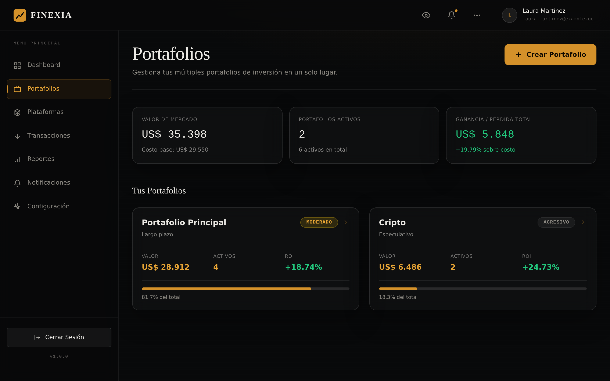

En **Portafolios** verás:

- Un **encabezado con el valor total** y la ganancia/pérdida global de todos tus portafolios.
- La sección **"Tus Portafolios"**, con una tarjeta por portafolio mostrando su valor, rendimiento, tipo y moneda.

Pulsa sobre cualquier portafolio para abrir su **detalle**.

### 6.2 Crear un portafolio

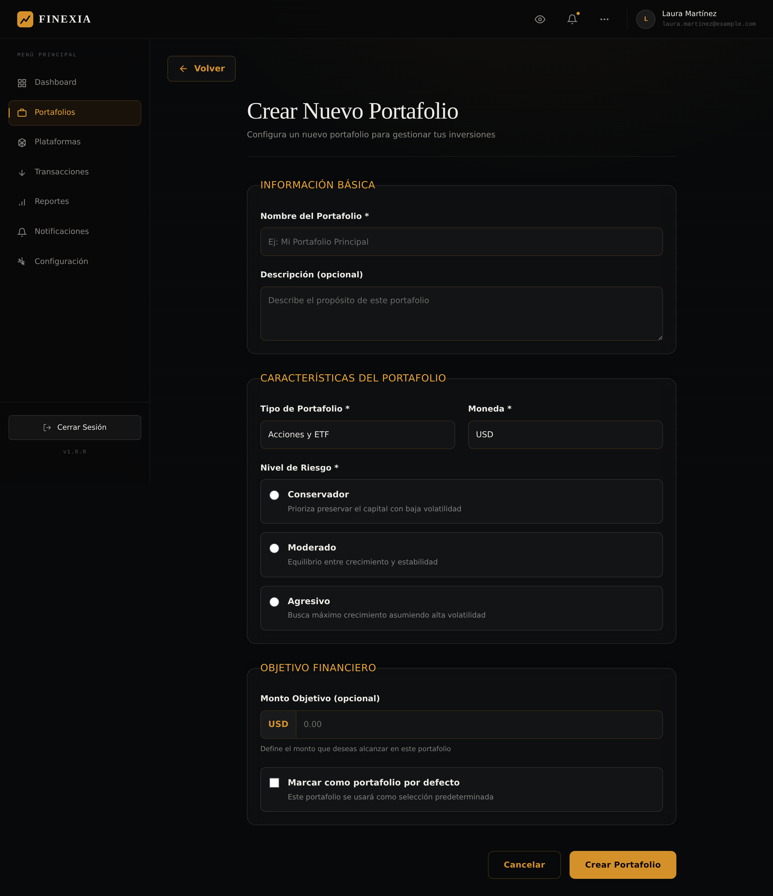

1. En **Portafolios**, pulsa **Crear / Añadir portafolio**.
2. Completa el formulario:
   - **Nombre del Portafolio** (obligatorio) — p. ej. "Mi Portafolio Principal".
   - **Descripción** (opcional) — el propósito del portafolio.
   - **Tipo de Portafolio** (obligatorio) — la clase de portafolio que corresponda (largo plazo, especulativo…).
   - **Moneda** (obligatorio) — la moneda base en la que se valorará el portafolio.
   - **Nivel de Riesgo** (obligatorio) — elige entre los perfiles disponibles: **Conservador** (prioriza preservar el capital), **Moderado** (equilibrio entre crecimiento y estabilidad) o **Agresivo** (busca máximo crecimiento asumiendo alta volatilidad).
   - **Monto Objetivo** (opcional) — la meta de valor que quieres alcanzar.
3. Guarda. El nuevo portafolio aparecerá en tu lista.

### 6.3 Detalle de un portafolio

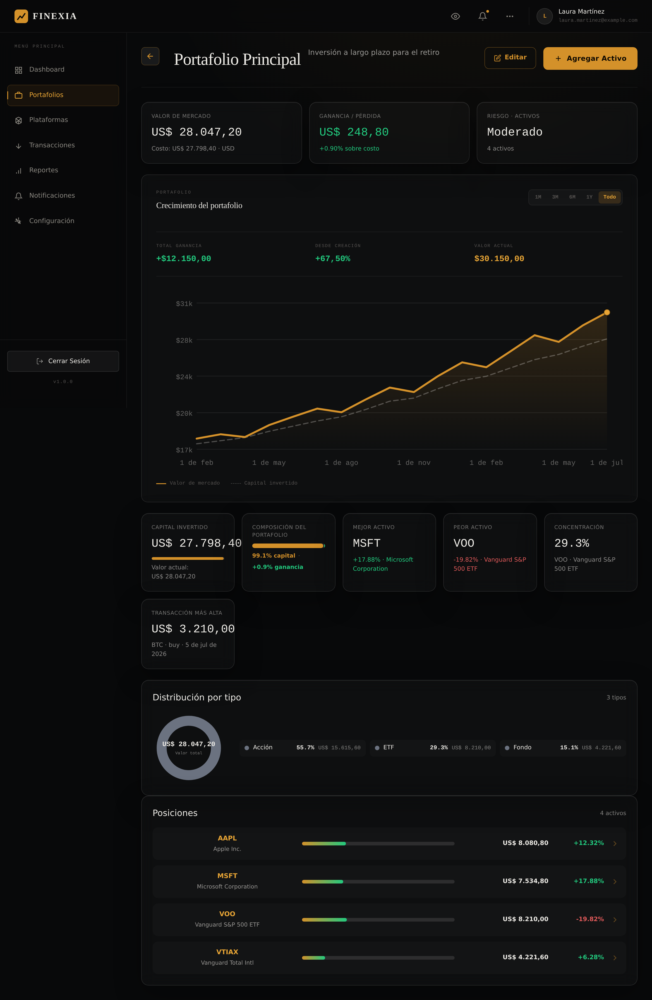

La página de detalle muestra:

- **Indicadores principales:** valor actual, ganancia/pérdida total y métricas del portafolio.
- **Distribución por tipo:** gráfica con el reparto del portafolio por tipo de activo.
- **Posiciones:** la lista de activos que componen el portafolio, con su cantidad, precio de compra, precio de mercado y rendimiento. Desde aquí puedes añadir posiciones nuevas o entrar al detalle de cada activo.
- **Crecimiento:** evolución histórica del valor del portafolio.
- **Mayor transacción:** la operación de mayor importe registrada en el portafolio.

### 6.4 Editar un portafolio

En el detalle del portafolio, pulsa **Editar portafolio** para modificar su nombre, descripción, tipo, riesgo o monto objetivo, y guarda los cambios.

---

## 7. Posiciones y activos

Una **posición** representa la tenencia de un activo concreto dentro de un portafolio: por ejemplo, 42 acciones de AAPL en tu portafolio "Principal".

### 7.1 Añadir una posición

1. Entra al **detalle del portafolio** y pulsa **Añadir posición / activo**.
2. **Busca el activo** escribiendo su ticker o nombre (p. ej. `AAPL`, `Bitcoin`). La aplicación busca en el catálogo de activos disponible.
3. Indica:
   - **Cantidad** — número de unidades que posees.
   - **Precio de compra** — precio por unidad (p. ej. `150.50`).
   - **Fecha de compra** y **categoría** del activo.
   - **Plataforma** — dónde tienes el activo (de tu lista de Plataformas).
   - **Notas** (opcional) — cualquier comentario sobre la posición.
4. Guarda. La posición aparecerá en la lista del portafolio y sus importes se sumarán al valor total.

> **Nota:** si el activo que buscas no aparece en el catálogo, contacta con el equipo de soporte de Finexia para solicitar que lo incorporen.

### 7.2 Detalle de un activo en el portafolio

Al pulsar sobre una posición se abre la vista del activo dentro de ese portafolio (el botón **Volver** te devuelve al detalle del portafolio).

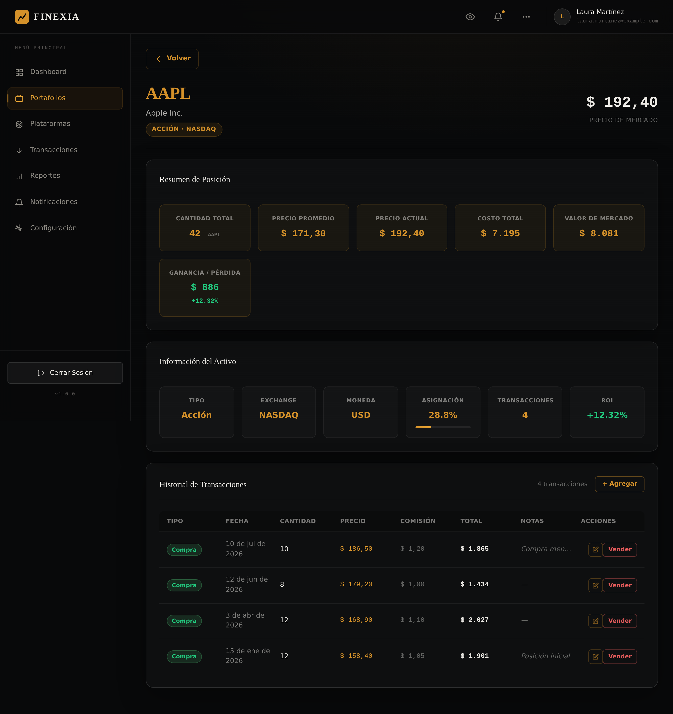

La vista incluye:

- El **precio de mercado** actual del activo, junto a su ticker, nombre, tipo y exchange.
- **Resumen de Posición:** cantidad total, precio promedio de compra, precio actual, costo total, valor de mercado y **ganancia/pérdida** en importe y porcentaje.
- **Información del Activo:** tipo, exchange donde cotiza, moneda, porcentaje de **asignación** dentro del portafolio, número de **transacciones** y **ROI** (retorno sobre la inversión).
- **Historial de Transacciones:** todas las compras y ventas de ese activo, con tipo, fecha, cantidad, precio, comisión, total y notas.

Desde esta misma vista puedes **registrar nuevas operaciones**: el botón **+ Agregar** crea una transacción nueva, y cada fila del historial ofrece acciones para **editar** la operación o registrar una **venta** (ver sección 9).

### 7.3 Precios de los activos

Los precios de los activos se actualizan automáticamente desde proveedores de datos de mercado. El valor de tus posiciones se recalcula con el último precio disponible, por lo que tu patrimonio refleja la cotización más reciente sin que tengas que hacer nada.

---

## 8. Plataformas

Las **plataformas** son los lugares donde custodias tus activos: brokers, exchanges de criptomonedas, bancos, etc. Registrarlas te permite saber siempre **dónde** está cada inversión.

> **Recuerda:** Finexia solo guarda el nombre y la descripción de la plataforma. **Nunca** se conecta a ella ni almacena tus credenciales.

### 8.1 Ver tus plataformas

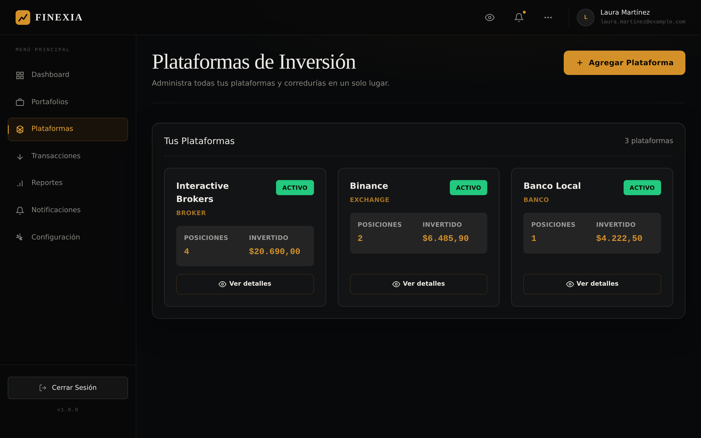

En **Plataformas** aparece la sección **"Tus Plataformas"** con las que hayas registrado: para cada una se muestra su tipo (broker, exchange, banco…), el número de inversiones asociadas y el valor total que tienes en ella. Si aún no tienes ninguna, verás el mensaje "No hay plataformas registradas" con la opción de crear la primera.

### 8.2 Añadir una plataforma

1. Pulsa **Añadir plataforma**.
2. Introduce:
   - **Nombre** — p. ej. "Interactive Brokers", "Binance", "Mi banco".
   - **Descripción** — información adicional (opcional).
3. Guarda. La plataforma quedará disponible para asociarla a posiciones y transacciones.

### 8.3 Editar o eliminar una plataforma

Desde la tarjeta o el detalle de la plataforma puedes **editar** sus datos o **eliminarla**. Ten en cuenta que la eliminación es permanente; si la plataforma tiene posiciones asociadas, revisa primero su contenido.

---

## 9. Transacciones

Las **transacciones** son las operaciones de compra y venta que dan forma a tus posiciones. Mantenerlas al día es la clave para que los valores, ganancias y reportes sean fieles a la realidad.

### 9.1 Ver el historial

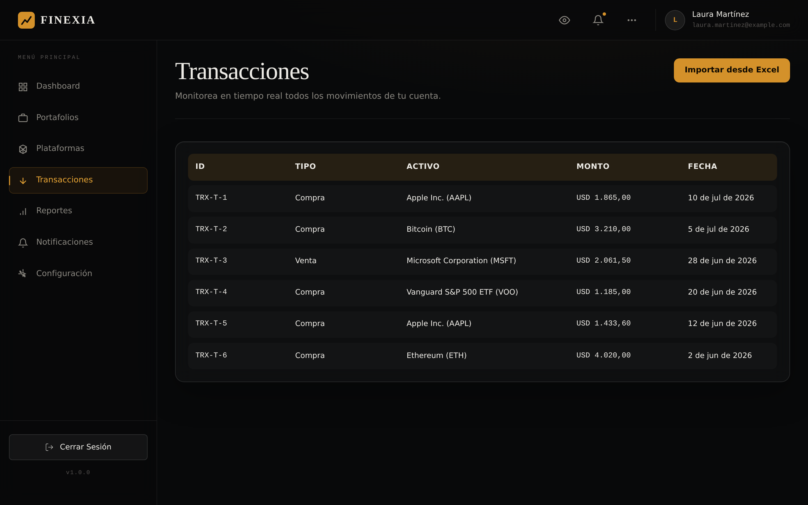

La sección **Transacciones** muestra el historial de operaciones más recientes de todos tus portafolios, con fecha, activo, tipo de operación (compra o venta), cantidad, precio e importe. Desde el detalle de cada posición (sección 7.2) puedes ver el historial filtrado por activo.

### 9.2 Registrar una transacción

1. Entra a la posición correspondiente (portafolio → posición) o usa la acción **Nueva transacción**.
2. Indica:
   - **Tipo de operación** — compra o venta.
   - **Fecha** de la operación.
   - **Cantidad** de unidades.
   - **Precio** por unidad.
   - **Comisiones** u otros costes, si aplica.
3. Guarda. La posición y el portafolio se recalculan automáticamente.

### 9.3 Editar una transacción

Si cometiste un error, abre la transacción desde el historial y pulsa **Editar**. Corrige los datos y guarda; los totales se actualizarán.

---

## 10. Importación masiva de transacciones (Excel/CSV)

Si ya llevas tu registro en una hoja de cálculo, no necesitas volver a teclearlo todo: Finexia puede **importar tus transacciones desde un archivo Excel o CSV**. La propia página lo resume así: *"Sube el Excel donde llevas tu registro de inversiones: detectamos tus columnas y las adaptamos automáticamente."*

El proceso tiene tres pasos, indicados en la parte superior: **1 · Archivo**, **2 · Columnas y vista previa** y **3 · Resultado**.

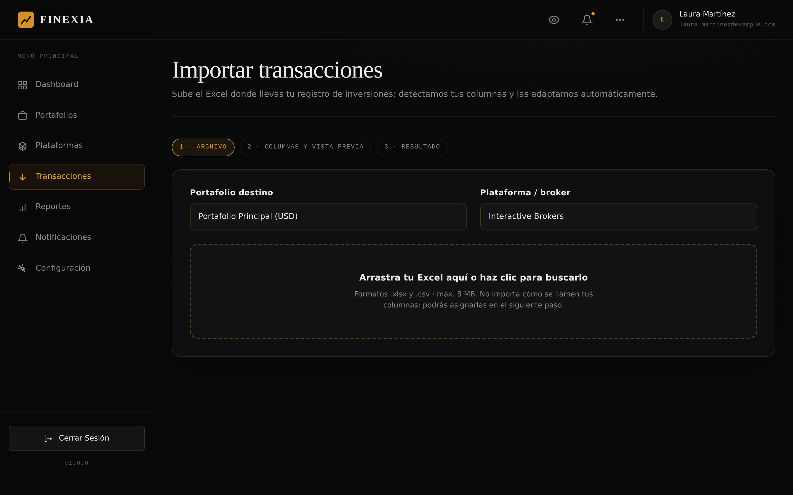

### 10.1 Paso 1 — Archivo

1. Ve a **Transacciones → Importar**.
2. Selecciona el **Portafolio destino** (dónde se crearán las transacciones) y la **Plataforma / broker** a la que corresponden.
3. **Arrastra tu Excel** a la zona de carga **o haz clic para buscarlo** en tu equipo. Se admiten los formatos **.xlsx** y **.csv**, con un tamaño máximo de **8 MB**. No importa cómo se llamen tus columnas: podrás asignarlas en el siguiente paso.
4. La aplicación analizará el archivo ("Analizando tu archivo…"). Si el libro tiene varias hojas, selecciona la **hoja** que contiene las transacciones.

### 10.2 Paso 2 — Columnas y vista previa

En la pantalla **"Asigna tus columnas"** la aplicación te dice cuántas columnas detectó en tu archivo y en qué fila están los encabezados, y te propone una **asignación sugerida** que puedes ajustar.

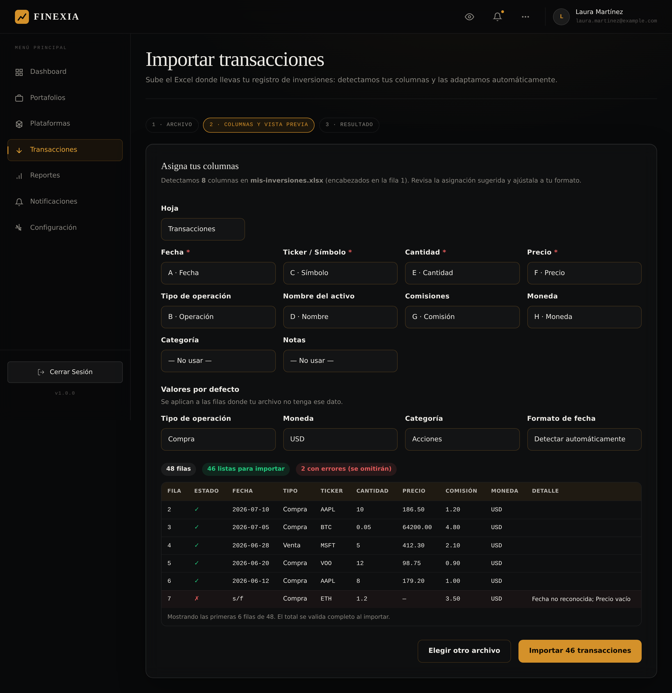

En esta pantalla:

- Si el libro tiene varias hojas, elige la **Hoja** correcta (al cambiarla, la aplicación vuelve a sugerir la asignación).
- Asigna cada dato a una columna de tu archivo. Los campos **Fecha**, **Ticker/Símbolo**, **Cantidad** y **Precio** son obligatorios (marcados con `*`); **Tipo de operación**, **Nombre del activo**, **Comisiones**, **Moneda**, **Categoría** y **Notas** son opcionales — puedes dejarlos en **"— No usar —"**.
- En **Valores por defecto** defines lo que se aplicará a las filas donde tu archivo no tenga ese dato: tipo de operación, moneda, categoría y formato de fecha (con detección automática).
- La **vista previa** resume el resultado con contadores (p. ej. "48 filas · 46 listas para importar · 2 con errores (se omitirán)") y muestra las primeras filas interpretadas: las válidas con ✓ y las que se omitirán con ✗ y el **motivo del error** (fecha no reconocida, precio vacío…), para que puedas corregir tu archivo si lo deseas.

### 10.3 Paso 3 — Resultado

1. Cuando la asignación sea correcta, pulsa **Importar N transacciones** (el botón indica cuántas filas válidas se crearán). Si prefieres empezar de nuevo, usa **Elegir otro archivo**.
2. Las transacciones se crearán en el portafolio elegido y verás el **resultado** del proceso: cuántas se importaron, cuántas se omitieron y el detalle de los errores, si los hubo.

> **Consejos para una buena importación:**
> - Usa una fila de encabezados clara en tu hoja.
> - Mantén formatos de fecha y número consistentes.
> - Los símbolos/tickers deben coincidir con los del catálogo de activos.
> - Puedes repetir la vista previa tantas veces como necesites antes de confirmar; nada se guarda hasta el paso final.

---

## 11. Reportes y exportaciones

La sección **Reportes** ("Gestiona y descarga documentos financieros de tu cuenta") concentra el análisis de rendimiento.

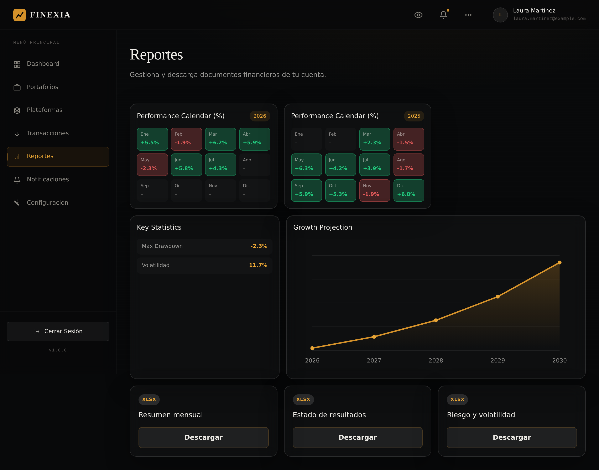

### 11.1 Reportes en pantalla

- **Performance Calendar (%):** calendario de rendimiento con el porcentaje de ganancia o pérdida de cada mes, agrupado por año. Los meses en verde fueron positivos y los meses en rojo, negativos, para identificar de un vistazo los mejores y peores tramos.
- **Key Statistics:** estadísticas clave del portafolio, como el **Max Drawdown** (la mayor caída desde un máximo) y la **Volatilidad**.
- **Growth Projection:** proyección de crecimiento estimada a futuro según la evolución de tu portafolio.

### 11.2 Descargas en Excel (XLSX)

En la parte inferior de la página encontrarás las tarjetas de descarga; pulsa **Descargar** en la que necesites:

| Reporte | Contenido |
|---|---|
| **Resumen mensual** | Resumen mes a mes del portafolio |
| **Estado de resultados** | Historial completo de transacciones |
| **Riesgo y volatilidad** | Métricas de riesgo y volatilidad |

Los archivos se descargan directamente a tu equipo en formato Excel (XLSX) y puedes abrirlos con Excel, LibreOffice o Google Sheets.

---

## 12. Notificaciones

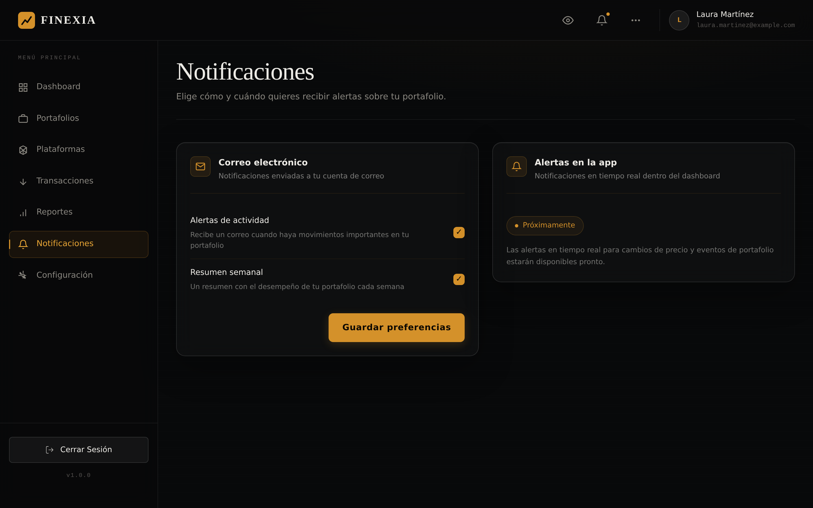

En **Notificaciones** configuras cómo quieres que Finexia te avise:

### 12.1 Correo electrónico

- **Alertas de actividad:** recibe un correo cuando ocurra actividad relevante en tu cuenta.
- **Resumen semanal:** un correo periódico con el resumen de la evolución de tus portafolios.

### 12.2 Alertas en la app

Activa o desactiva los avisos que se muestran dentro de la propia aplicación.

Marca o desmarca cada opción según tu preferencia; los cambios se guardan en tus preferencias de usuario.

---

## 13. Configuración de la cuenta

La página **Configuración** agrupa todo lo relativo a tu cuenta, en secciones:

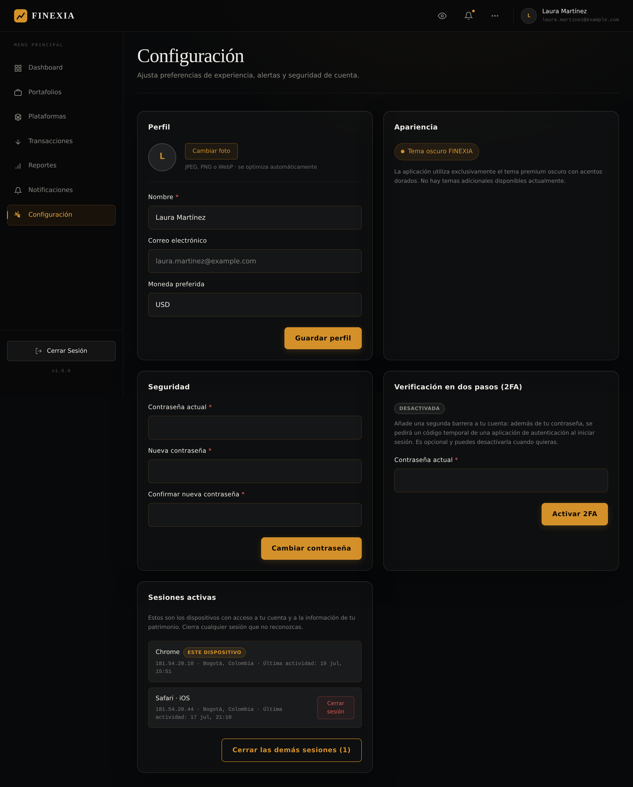

### 13.1 Perfil

- Edita tu **nombre** y datos personales.
- **Sube o cambia tu avatar** (imagen de perfil), que se mostrará en la cabecera y en tu perfil.
- Tu correo electrónico identifica tu cuenta.

### 13.2 Apariencia

Ajusta las preferencias visuales de la aplicación (tema/aspecto de la interfaz) a tu gusto. Los cambios se aplican de inmediato y quedan guardados en tus preferencias.

### 13.3 Seguridad

- **Cambiar contraseña:** introduce tu contraseña actual y la nueva. Usa contraseñas largas y únicas.
- **Verificación en dos pasos (2FA)** y **Sesiones activas:** ver sección 14.

---

## 14. Seguridad: 2FA y sesiones

### 14.1 Activar la verificación en dos pasos (2FA)

La 2FA añade una segunda barrera al inicio de sesión: además de tu contraseña, necesitarás un código temporal generado por tu aplicación de autenticación.

1. Ve a **Configuración → Verificación en dos pasos (2FA)** y pulsa **Activar**.
2. **Escanea el código QR** con tu aplicación de autenticación (Google Authenticator, Authy, 1Password, etc.). Si no puedes escanear, usa la **"Clave para ingreso manual"** que se muestra junto al QR.
3. Introduce el **código de 6 dígitos** que genera la aplicación para confirmar la activación.
4. **Guarda tus códigos de recuperación.** La aplicación te mostrará una lista de códigos de un solo uso: descárgalos o cópialos y guárdalos en un lugar seguro (gestor de contraseñas, papel en lugar protegido). Son tu única vía de acceso si pierdes el teléfono.

A partir de ese momento, cada inicio de sesión pedirá el código temporal.

### 14.2 Códigos de recuperación y desactivación

- **Usar un código de recuperación:** en el segundo paso del login, introduce uno de tus códigos de recuperación en lugar del código temporal. Cada código sirve **una sola vez**.
- **Regenerar códigos:** desde la sección 2FA puedes generar una nueva lista (la anterior queda invalidada).
- **Desactivar 2FA:** desde la misma sección, confirmando con un código válido. Tu cuenta volverá a protegerse solo con contraseña (no recomendado).

### 14.3 Sesiones activas

En **Configuración → Sesiones activas** verás todos los dispositivos/navegadores con sesión abierta en tu cuenta, con información para identificarlos (dispositivo, ubicación aproximada y última actividad).

- **Revocar una sesión:** cierra la sesión de un dispositivo concreto.
- **Cerrar las demás sesiones:** cierra todas las sesiones excepto la actual. Útil si sospechas que alguien más accedió a tu cuenta (en ese caso, cambia también tu contraseña).

---

## 15. Preguntas frecuentes (FAQ)

**¿Finexia se conecta a mis brokers o plataformas?**
No. Finexia nunca accede a tus plataformas ni te pide credenciales. Tú registras manualmente dónde tienes tus activos, así que la información siempre está bajo tu control.

**¿Puedo tener varios portafolios?**
Sí, puedes crear tantos como necesites, cada uno con su moneda, tipo, nivel de riesgo y monto objetivo propios.

**¿Cómo se calculan los valores de mis posiciones?**
Con el último precio disponible de cada activo (actualizado automáticamente desde proveedores de datos de mercado), multiplicado por tu cantidad, y convertido a la moneda del portafolio con las tasas de cambio del sistema.

**¿Puedo importar mi histórico desde Excel?**
Sí. Usa **Transacciones → Importar**: sube el archivo (.xlsx o .csv, máximo 8 MB), asigna las columnas, revisa la vista previa (incluidas las filas omitidas) y confirma. Nada se guarda hasta que confirmas.

**No encuentro un activo al crear una posición. ¿Qué hago?**
El activo aún no está en el catálogo. Contacta con el equipo de soporte de Finexia para solicitar que lo añadan.

**¿Qué pasa si pierdo mi teléfono con la app de autenticación?**
Usa uno de tus **códigos de recuperación** para entrar y luego reconfigura la 2FA. Si tampoco tienes los códigos, contacta con el soporte de Finexia.

**¿Puedo usar Finexia en el móvil?**
Sí. La interfaz es adaptable; en pantallas pequeñas el menú lateral se abre desde el botón de la cabecera (ver sección 4.4).

**¿Cómo exporto mis datos?**
Desde **Reportes** puedes descargar en Excel el resumen mensual, el estado de resultados (transacciones) y las métricas de riesgo y volatilidad.

---

## 16. Solución de problemas

| Problema | Causa probable | Solución |
|---|---|---|
| "Correo sin verificar" al iniciar sesión | No abriste el enlace de verificación | Reenvía el correo de verificación desde la propia pantalla y revisa spam |
| "Demasiados intentos" (error 429) | Límite de peticiones por seguridad | Espera unos minutos y vuelve a intentarlo |
| El enlace de invitación o de restablecimiento no funciona | Enlace caducado o ya usado | Solicita un nuevo enlace o el reenvío de la invitación |
| No puedo registrarme | El registro directo está deshabilitado | Únete a la lista de espera para recibir una invitación |
| El código 2FA no es aceptado | Reloj del teléfono desincronizado o código expirado | Sincroniza la hora del dispositivo y usa el código vigente; como alternativa, un código de recuperación |
| Mi sesión se cerró sola | La sesión fue revocada o expiró | Inicia sesión de nuevo; revisa **Sesiones activas** si no fuiste tú |
| Una importación omite filas | Datos incompletos o formatos no interpretables | Revisa el detalle de **Filas omitidas**, corrige el archivo y repite la vista previa |
| Los valores no cuadran con mi broker | Falta registrar transacciones o el precio aún no se actualiza | Completa el historial de transacciones y vuelve a revisar más tarde |

Si el problema persiste, contacta con el equipo de soporte de Finexia.

---

## 17. Glosario

| Término | Definición |
|---|---|
| **Activo** | Instrumento financiero: acción, criptomoneda, ETF, fondo, etc., identificado por su símbolo/ticker |
| **Posición** | Tenencia de un activo dentro de un portafolio (cantidad + coste) |
| **Portafolio** | Conjunto de posiciones agrupadas bajo un objetivo, con moneda y nivel de riesgo propios |
| **Plataforma** | Broker, exchange o entidad donde custodias tus activos |
| **Transacción** | Operación de compra o venta que modifica una posición |
| **Asignación** | Porcentaje que representa un activo o tipo de activo dentro del total |
| **ROI** | *Return on Investment*: retorno sobre la inversión, en porcentaje |
| **Max Drawdown** | La mayor caída porcentual del valor desde un máximo anterior |
| **Volatilidad** | Medida de la variabilidad del valor de un activo o portafolio |
| **2FA / TOTP** | Verificación en dos pasos con códigos temporales de 6 dígitos |
| **Códigos de recuperación** | Códigos de un solo uso para acceder si pierdes tu aplicación de autenticación |
| **Lista de espera** | Registro público para solicitar acceso anticipado a la plataforma |
| **Invitación** | Enlace enviado a tu correo para crear una cuenta |
| **XLSX** | Formato de archivo de Excel usado en las exportaciones |

---

*Este manual describe la funcionalidad de Finexia a la fecha indicada en la portada. Las pantallas y textos pueden variar ligeramente según la versión desplegada.*
