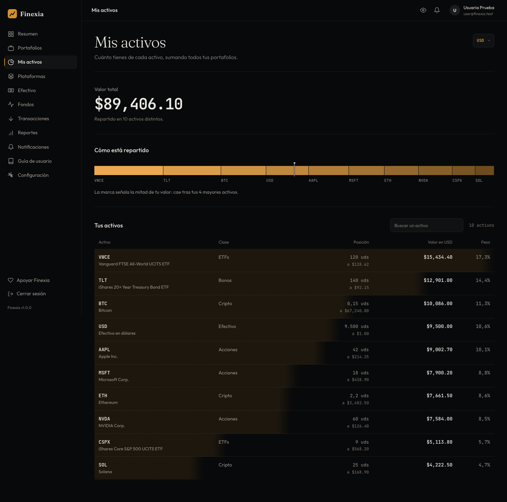
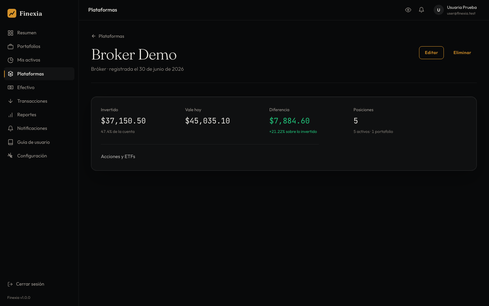

# Manual de Usuario — FINEXIA

**Versión del documento:** 2.0
**Fecha:** Septiembre 2026
**Aplicación:** Finexia — Plataforma de gestión y seguimiento de portafolios de inversión

---

## Tabla de contenido

1. [Introducción](#1-introducción)
2. [Requisitos y acceso](#2-requisitos-y-acceso)
3. [Primeros pasos: registro e inicio de sesión](#3-primeros-pasos-registro-e-inicio-de-sesión)
4. [Interfaz general de la aplicación](#4-interfaz-general-de-la-aplicación)
5. [Dashboard (panel principal)](#5-dashboard-panel-principal)
6. [Portafolios](#6-portafolios)
7. [Posiciones y activos](#7-posiciones-y-activos)
8. [Mis Activos (vista consolidada)](#8-mis-activos-vista-consolidada)
9. [Plataformas](#9-plataformas)
10. [Transacciones](#10-transacciones)
11. [Importación masiva de transacciones (Excel/CSV)](#11-importación-masiva-de-transacciones-excelcsv)
12. [Reportes y exportaciones](#12-reportes-y-exportaciones)
13. [Notificaciones](#13-notificaciones)
14. [Configuración de la cuenta](#14-configuración-de-la-cuenta)
15. [Seguridad: 2FA y sesiones](#15-seguridad-2fa-y-sesiones)
16. [Conectar un asistente de IA (MCP)](#16-conectar-un-asistente-de-ia-mcp)
17. [Preguntas frecuentes (FAQ)](#17-preguntas-frecuentes-faq)
18. [Solución de problemas](#18-solución-de-problemas)
19. [Glosario](#19-glosario)

---

## 1. Introducción

### 1.1 ¿Qué es Finexia?

Finexia es una aplicación web para **gestionar y hacer seguimiento de tus portafolios de inversión** en un solo lugar. Te permite registrar tus activos (acciones, criptomonedas, ETFs, fondos y otros instrumentos), las plataformas donde los tienes, y todas tus transacciones de compra y venta, para luego visualizar el rendimiento, la distribución y el crecimiento de tu patrimonio con gráficas y reportes descargables.

### 1.2 Principios clave

- **Tú controlas tus datos.** Finexia **no se conecta a tus brokers ni a tus plataformas de inversión**, y nunca te pedirá las credenciales de esas cuentas. Toda la información se registra manualmente (o mediante importación de archivos Excel/CSV), por lo que siempre está bajo tu control.
- **Multi-portafolio.** Puedes crear tantos portafolios como necesites (por ejemplo: "Retiro", "Cripto", "Fondo de emergencia") y analizarlos de forma individual o agregada.
- **Multi-moneda.** Cada portafolio tiene una moneda base y la aplicación convierte automáticamente los valores entre monedas para mostrarte tu patrimonio consolidado.
- **Seguridad primero.** La aplicación incluye verificación de correo electrónico, autenticación en dos pasos (2FA), gestión de sesiones activas y protección contra intentos de acceso masivos.

---

## 2. Requisitos y acceso

### 2.1 Requisitos

- Un navegador web moderno y actualizado (Chrome, Firefox, Safari o Edge).
- Conexión a internet.
- Una dirección de correo electrónico válida (necesaria para verificar la cuenta y recuperar la contraseña).
- Opcional, pero recomendado: una aplicación de autenticación (Google Authenticator, Authy, 1Password, etc.) para activar la verificación en dos pasos.

La aplicación es **responsive**: funciona tanto en computadoras de escritorio como en tabletas y teléfonos móviles. En pantallas pequeñas el menú lateral se oculta y se abre con el botón de menú de la cabecera.

### 2.2 Página de inicio (landing) y lista de espera

Al visitar la dirección pública de Finexia sin haber iniciado sesión verás la página de presentación. Además de la descripción del producto y sus beneficios, incluye un recorrido por las cuatro vistas del panel (**El producto**), las garantías de seguridad de la plataforma (**Seguridad**), las preguntas frecuentes y las páginas legales (Términos, Privacidad y Cookies). En pantallas pequeñas el menú se abre con el botón de la esquina superior derecha.


Si el registro directo no está habilitado, la página te ofrece unirte a la **lista de espera** dejando tu correo electrónico en el formulario de **"Acceso anticipado"**. El equipo de Finexia podrá luego enviarte una **invitación** para crear tu cuenta.

---

## 3. Primeros pasos: registro e inicio de sesión

### 3.1 Crear una cuenta

Existen dos vías para obtener una cuenta:

**A) Registro directo** (si está habilitado):

1. En la página de inicio, pulsa **Registrarse / Crear cuenta**.
2. Completa tus datos: nombre, correo electrónico y contraseña.
3. Envía el formulario. Recibirás un **correo de verificación**.
4. Abre el enlace del correo para **verificar tu dirección**. Sin este paso no podrás iniciar sesión (el sistema mostrará un aviso de "correo sin verificar").

> **Nota:** si el registro directo está desactivado, el formulario mostrará un aviso indicando que el registro está deshabilitado. En ese caso, únete a la lista de espera para recibir una invitación.

**B) Por invitación:**

1. Recibirás en tu correo una invitación para unirte a Finexia.
2. Abre el enlace **Aceptar invitación** del correo. La aplicación validará la invitación.
3. Define tu contraseña y confirma. Tu cuenta quedará creada y verificada, lista para iniciar sesión.

Las invitaciones tienen caducidad; si el enlace expiró, solicita que te la reenvíen.

### 3.2 Iniciar sesión


1. Ve a la página de **Iniciar sesión**.
2. Introduce tu correo y contraseña.
3. Si tienes **2FA activado**, la aplicación te pedirá un segundo paso: introduce el **código de 6 dígitos** de tu aplicación de autenticación (o uno de tus códigos de recuperación).
4. Al completar el acceso entrarás directamente al **Dashboard**.

La sesión se mantiene mediante un token de acceso de corta duración y una cookie segura de renovación que se rota automáticamente; no necesitas hacer nada para mantener la sesión activa mientras uses la aplicación.

### 3.3 ¿Olvidaste tu contraseña?

1. En la pantalla de inicio de sesión, pulsa **¿Olvidaste tu contraseña?**
2. Introduce tu correo electrónico. Si existe una cuenta asociada, recibirás un enlace de restablecimiento.
3. Abre el enlace, define tu **nueva contraseña** y confírmala.
4. Inicia sesión con la nueva contraseña.

Los enlaces de restablecimiento caducan por seguridad; si el tuyo expiró, solicita uno nuevo.

### 3.4 Verificación de correo

Si intentas iniciar sesión sin haber verificado tu correo, la aplicación te lo indicará y te permitirá **reenviar el correo de verificación**. Revisa también la carpeta de spam.

### 3.5 Cerrar sesión

Usa el botón **Cerrar Sesión** situado en la parte inferior de la barra lateral. También puedes cerrar sesiones abiertas en otros dispositivos desde **Configuración → Sesiones abiertas** (ver sección 15.3).

---

## 4. Interfaz general de la aplicación

Una vez dentro, la aplicación se organiza en tres zonas:

### 4.1 Cabecera (header)

Situada en la parte superior. Contiene:

- El botón de **menú** (en pantallas pequeñas) para mostrar/ocultar la barra lateral.
- Accesos rápidos y el indicador de **notificaciones**.
- Tu **avatar**, nombre y correo de la cuenta.

### 4.2 Barra lateral (menú principal)

Es el menú de navegación. Sus secciones son:

| Sección | ¿Para qué sirve? |
|---|---|
| **Dashboard** | Vista general: patrimonio neto, crecimiento y actividad reciente |
| **Portafolios** | Crear y gestionar tus portafolios y sus posiciones |
| **Mis Activos** | Cuánto tienes de cada activo, sumando todos tus portafolios |
| **Plataformas** | Registrar los brokers/exchanges/bancos donde tienes activos |
| **Transacciones** | Historial de operaciones e importación desde Excel/CSV |
| **Reportes** | Rentabilidad mes a mes, medidas de riesgo, proyección y descargas en Excel |
| **Notificaciones** | Preferencias de avisos por correo y en la app |
| **Guía de usuario** | Este manual, para consultarlo en pantalla o descargarlo |
| **Configuración** | Perfil, contraseña, 2FA, sesiones abiertas, claves de datos de mercado y acceso para asistentes |

En la parte inferior de la barra lateral está el botón **Cerrar Sesión**.

### 4.3 Área de contenido

Es la zona central donde se muestra cada página. En la mayoría de listados encontrarás paginación y acciones contextuales (crear, editar, eliminar).

### 4.4 Uso en el móvil

La interfaz se adapta automáticamente a pantallas pequeñas: el contenido ocupa todo el ancho y la barra lateral queda oculta.


Para navegar, pulsa el **botón de menú** (las tres líneas de la esquina superior izquierda): la barra lateral se despliega con las mismas secciones que en escritorio y se cierra al elegir una opción o al tocar fuera de ella.


Todas las funciones descritas en este manual están disponibles también desde el móvil.

### 4.5 La guía de usuario dentro de la aplicación

No hace falta buscar este manual fuera de Finexia: la entrada **Guía de usuario** del menú lateral lo abre dentro de la propia aplicación.


Arriba está la ficha del documento —la **versión**, la **fecha** y el **tamaño** del PDF que se está sirviendo— con tres formas de usarlo:

- **Ver la guía aquí** — la abre incrustada en la página, sin salir de la aplicación.
- **Descargar PDF** — la guarda en tu equipo para leerla sin conexión.
- **Abrir en pestaña nueva** — útil para consultarla mientras trabajas en otra sección.

Debajo está el **índice**, repartido en cuatro bloques —«Para empezar», «El día a día», «Tu cuenta» y «Si te atascas»— para que sepas por dónde buscar sin recorrer los diecinueve títulos. La numeración es la misma que la de este documento: el número que ves en el índice es el capítulo que hay que buscar dentro del PDF.

> **Sobre la versión que ves:** el PDF se genera a partir del manual del repositorio y la aplicación comprueba en cada integración que el archivo publicado corresponde al texto vigente. Si la fecha que ves es antigua, es porque el manual no ha cambiado desde entonces, no porque se haya quedado sin actualizar.

---

## 5. Dashboard (panel principal)

El Dashboard es la primera pantalla tras iniciar sesión y ofrece una fotografía general de tus finanzas.


Sus bloques principales son:

- **Patrimonio Neto:** el valor total de todos tus portafolios, con la ganancia acumulada en importe y porcentaje, el número de portafolios y de posiciones. Con el selector de moneda (p. ej. **USD/COP**) puedes ver el total consolidado en la moneda que prefieras.
- **Crecimiento del portafolio:** gráfica de evolución de tu patrimonio que compara el **valor de mercado** (línea continua ámbar) con el **capital invertido** (línea discontinua). Puedes cambiar el periodo mostrado (1M, 3M, 6M, 1Y o Todo), pasar la gráfica a **porcentaje** con el conmutador **Valor / %**, y ver la ganancia total, el rendimiento, la **rentabilidad real** del periodo y el valor actual.
- **Portafolios:** tabla resumen con cada portafolio, su tipo, valor actual, importe invertido y ganancia/pérdida (en verde si es positiva, en rojo si es negativa), junto con los totales. El nombre de cada fila lleva a su detalle.
- **Asignación de Activos:** gráfica de dona con la distribución porcentual de tu dinero entre tipos de activos (acciones, ETF, criptomonedas, fondos…).
- **Actividad Reciente:** las últimas compras y ventas registradas, con acceso a **Ver todo** y a **Descargar extracto**.

### 5.1 Consultar un día concreto en la gráfica

La gráfica de crecimiento no es solo una imagen: **pasa el cursor por encima** y una línea vertical marcará el día bajo el ratón. Justo encima de la gráfica aparecerá su detalle: la fecha, el **valor de mercado**, el **capital invertido** y la **ganancia** de ese día.

Si prefieres el teclado, pulsa **Tab** hasta llegar a la gráfica y recórrela con las **flechas izquierda y derecha**; **Inicio** y **Fin** saltan al primer y último día, y **Esc** quita la selección. Cada punto se anuncia en voz alta, de modo que la gráfica también se puede leer con un lector de pantalla.

### 5.2 Ver la gráfica en porcentaje

Junto a los botones de periodo hay un conmutador con dos posiciones: **Valor** y **%**. El primero es la vista de siempre, en dinero. El segundo dibuja la misma serie en **rentabilidad**, y es la que contesta a la pregunta de cuánto has ganado, no de cuánto tienes.

La diferencia importa más de lo que parece. En dinero, tu patrimonio sube cuando el mercado te da la razón **y también cuando metes un depósito**: las dos cosas empujan la curva hacia arriba y la gráfica no las distingue. En porcentaje se dibujan dos líneas que sí lo hacen:

| Línea | Qué mide |
|---|---|
| **Rentabilidad acumulada** (ámbar) | Lo que rindió tu dinero desde el inicio del periodo que estés viendo, **descontando aportes y retiros**. Un depósito no la mueve: solo el mercado la mueve |
| **Ganancia sobre coste** (gris discontinua) | Lo que vale tu cartera frente a lo que te costó, día a día. Esta sí depende de *cuándo* aportaste |

Cuando las dos líneas se separan, la distancia entre ellas es exactamente el efecto de tus movimientos de dinero: aportar antes de una subida las junta, aportar después las separa. La línea horizontal más marcada es el **equilibrio (0 %)**, la frontera entre ganar y perder.

Sobre la gráfica, la métrica **Rentabilidad real** lleva el periodo en su etiqueta (`Rentabilidad real · 3M`) porque, a diferencia de las otras tres, mide el tramo que estás viendo. Es la misma cifra que la línea ámbar al final de su recorrido.

> **Por qué no coincide con «Rendimiento».** El **Rendimiento** de al lado divide tu ganancia de hoy entre lo que llevas invertido hoy. Si metiste una cantidad grande justo después de una subida, esa cifra se hunde aunque tu cartera no haya perdido nada: el mismo beneficio repartido entre mucho más capital. La **Rentabilidad real** encadena lo que pasó en cada tramo y solo se mueve con el mercado. Las dos son correctas; contestan a preguntas distintas.

### 5.3 Leer la asignación de activos

En la dona, al señalar una porción —o su entrada en la leyenda— el resto se atenúa y el centro pasa a mostrar **esa categoría** con su porcentaje, en lugar del total. La leyenda funciona igual con el teclado y con un clic: cada entrada indica el importe y el peso de esa categoría dentro de tu patrimonio.

> **Consejo:** si acabas de crear tu cuenta, el Dashboard aparecerá vacío. Cada bloque te dirá qué falta y te ofrecerá el siguiente paso (crear un portafolio, importar transacciones…). El orden recomendado es: (1) registra tus **Plataformas**, (2) crea un **Portafolio**, (3) añade **posiciones** y (4) registra o importa tus **transacciones**.

---

## 6. Portafolios

Un **portafolio** agrupa un conjunto de posiciones (activos) con un objetivo común: por ejemplo, "Jubilación", "Cripto" o "Inversión a corto plazo".

### 6.1 Ver tus portafolios


En **Portafolios** verás una fila por portafolio, ordenadas de mayor a menor valor:

| Columna | Qué dice |
|---|---|
| **Portafolio** | El nombre y, debajo, la descripción que escribiste al crearlo y cuántas posiciones tiene. El que la aplicación usa por defecto lleva la marca **predeterminado** |
| **Riesgo** | El perfil que le pusiste: conservador, moderado o agresivo |
| **Capital y ganancia** | La barra. Lo azul es el capital que invertiste; lo verde, lo que ha ganado desde entonces. Si el portafolio está en pérdida, la barra se queda corta y una marca roja señala dónde estaba tu capital |
| **Valor** | Lo que vale hoy, en la moneda de tu cuenta |
| **Rendimiento** | Cuánto ha ganado o perdido sobre lo que costó |

Las barras se miden todas contra el portafolio más grande, así que su largo se compara directamente entre filas. **Al pie** de la lista está el total: lo que suman todos, el capital invertido entre todos y el rendimiento conjunto.

Pulsa el **nombre** de cualquier portafolio para abrir su **detalle**.

Si algún portafolio está en una moneda para la que no hay tasa de cambio, se sigue listando con su importe en su propia moneda, pero queda fuera del total: sumarlo daría una cifra que no está en ninguna moneda. La página lo avisa debajo de la lista.

### 6.2 Crear un portafolio


1. En **Portafolios**, pulsa **Crear portafolio**.
2. El formulario va en tres bloques, y cada uno dice a la izquierda qué se decide en él:

   | Bloque | Qué pide |
   |---|---|
   | **Cómo lo llamas** | El **nombre** con el que lo verás en el panel, y una **descripción** opcional |
   | **Qué guarda y en qué moneda** | El **tipo** (acciones y ETF, criptomonedas, bonos…) y la **moneda**: la que hablan sus totales, a la que Finexia convierte lo que compres en otra |
   | **Cómo lo quieres seguir** | El **nivel de riesgo** —**Conservador**, **Moderado** o **Agresivo**—, una **meta** opcional y si quieres que sea el portafolio que venga elegido de antemano al registrar un movimiento |

3. Pulsa **Crear portafolio**. El nuevo portafolio aparecerá en tu lista. Si algo falla, el formulario lo dice al pie, sobre el botón.

Solo el nombre y el nivel de riesgo hay que rellenarlos a mano: el resto llega con un valor puesto o se puede dejar en blanco, y lo que es opcional lo lleva escrito al lado de su etiqueta.

### 6.3 Detalle de un portafolio


La página de detalle tiene tres partes, en este orden:

- **Valor de mercado:** lo que vale hoy el portafolio, y debajo de qué capital viene: *«+$7.884,60 sobre los $37.150,50 que invertiste (+21,22%)»*. La barra reparte esa cifra entre lo que pusiste y lo que ha ganado, igual que en el listado (apartado 6.1).
- **Crecimiento:** la evolución del portafolio, con el mismo conmutador **Valor / %** y los mismos periodos que la gráfica del Dashboard. Sus cuatro cifras se refieren al **periodo elegido**, no a toda la vida del portafolio, así que la ganancia que muestran puede no coincidir con la de arriba. Entre ellas está la **rentabilidad real**: la del portafolio limpia de aportes y retiros —la misma cuenta que explica el apartado 5.2—, que aparece como `—` hasta que el portafolio acumule al menos dos cierres diarios.
- **Posiciones:** los activos del portafolio, de mayor a menor peso.

| Columna | Qué dice |
|---|---|
| **Activo** | El símbolo y el nombre. Pulsa el símbolo para entrar a su detalle |
| **Clase** | Acción, ETF, cripto, bono, efectivo… |
| **Peso** | Cuánto pesa sobre el portafolio, en barra y en porcentaje. La barra va de 0 a 100 %, así que se ve de un vistazo si una sola posición se ha comido el portafolio |
| **Valor** | Lo que vale esa tenencia, en la moneda base del portafolio |
| **Rendimiento** | Cuánto ha ganado o perdido sobre lo que costó |

Sobre la tabla, dos líneas resumen lo que costaría encontrar recorriéndola: el **reparto por clase de activo** (*«Acciones 54,4%, ETFs 45,6%»*) y **cuál ha rendido más y cuál menos**. Debajo de la tabla se anota la **mayor operación** registrada en el portafolio.

Desde el encabezado puedes **Editar** el portafolio o **Añadir activo**.

### 6.4 Editar un portafolio

En el detalle del portafolio, pulsa **Editar portafolio**: el formulario se abre en una ventana sobre la página con el nombre, la descripción, el tipo, el nivel de riesgo y el monto objetivo. Al guardar, la ventana se cierra y la página confirma que se actualizó.

---

## 7. Posiciones y activos

Una **posición** representa la tenencia de un activo concreto dentro de un portafolio: por ejemplo, 42 acciones de AAPL en tu portafolio "Principal".

### 7.1 Añadir una posición

Entra al **detalle del portafolio** y pulsa **Añadir activo**. La pantalla va en tres bloques, y cada uno dice a la izquierda qué se decide en él:

| Bloque | Qué pide |
|---|---|
| **Qué compraste** | El **activo**. Escribe su ticker o su nombre (p. ej. `AAPL`, `Bitcoin`) y elígelo de la lista; debajo aparece cuál has elegido, dónde cotiza y a cuánto, para confirmar que es el que buscabas |
| **Cuánto pagaste** | La **cantidad**, el **precio por unidad** con su **moneda** al lado —llega puesta la del activo y se cambia si tu bróker ejecutó en otra—, y la **fecha**. Se admiten todos los decimales que haga falta, así que un precio de `0.00004182` se guarda tal cual. Si tu cuenta liquidó en otra moneda, marca **«Mi cuenta liquidó en otra moneda»** e indica la moneda y la tasa (apartado 7.4) |
| **Dónde lo tienes** | La **plataforma**, de tu lista de Plataformas, y las **notas** que quieras |

Al cerrar el segundo bloque está el **total invertido**, y debajo la cuenta de la que sale —`12 × $186.90`—, con la conversión desglosada si la hubo. Es el número que puedes contrastar contra la confirmación de tu bróker antes de guardar: si no coincide, el precio o la tasa están mal y se ve sin salir de la pantalla.

Pulsa **Añadir activo**. La posición aparecerá en la lista del portafolio y sus importes se sumarán al valor total.

> **¿No aparece el activo que buscas?** Añadirlo a tu portafolio y crearlo en el catálogo son dos cosas distintas, y el buscador te deja hacer la segunda sin salir: te ofrece **Crear TICKER**. Rellena nombre, tipo y moneda (el mercado es opcional), y al crearlo queda elegido para que sigas con la posición. Los activos que creas los ves solo tú, hasta que el equipo de Finexia los incorpore al catálogo general. Puedes añadir hasta 50 activos nuevos cada 24 horas.

### 7.2 Detalle de un activo en el portafolio

Al pulsar sobre una posición se abre la vista del activo dentro de ese portafolio. El enlace de arriba, **Volver a**, nombra el portafolio del que saliste.


Arriba está el ticker, el nombre del activo, qué es y dónde cotiza. Debajo, lo que tienes aquí:

- **Cuántas unidades tienes** y **cuánto valen** hoy, en la moneda base del portafolio.
- **Cuánto has ganado o perdido** sobre lo que invertiste, en importe y en porcentaje. La barra reparte esa cifra: la parte fría es el capital que pusiste y la cálida, la ganancia. Es la misma barra del listado de portafolios (apartado 6.1), así que se lee igual.
- **Cuánto pagaste por unidad** frente a lo que cotiza hoy. Si compraste en una moneda y el activo cotiza en otra, la vista lo advierte: esos dos precios no se restan entre sí.
- **Cuánto pesa** esta posición dentro del portafolio.

Debajo, **Movimientos** lista todo lo que has registrado de este activo, del más reciente al más antiguo, con su fecha, cantidad, precio, comisión y total. Cada acción abre su propia ventana sobre la página:

- **Registrar movimiento** — arriba, junto al nombre del activo: anota una compra, una venta, un dividendo o cualquier otro movimiento sobre esta posición (sección 10.2).
- **Vender** — solo en las filas de compra y de transferencia de entrada, que son las que trajeron unidades. Abre el panel de venta con ese lote, entero o en parte (sección 10.4).
- **Editar** — corrige cualquier dato de una operación ya registrada.
- **Eliminar** — borra una operación. El diálogo enseña el tipo, la fecha y el total de la que vas a quitar, porque en una tabla todas las filas se parecen y esto no se puede deshacer. La posición se recalcula con las que queden; si era la última, la cantidad pasa a 0.

Al final de la página está **Quitar esta posición**, que no es lo mismo: la saca del portafolio **junto con todas sus transacciones**, y por eso el diálogo dice cuántas se van con ella. Ten en cuenta que hay una posición por plataforma —el mismo ticker comprado en dos brókers son dos posiciones—, así que cada una se elimina por separado.

### 7.3 Precios de los activos

Los precios vienen de proveedores de datos de mercado (Finnhub, Alpha Vantage), y **Finexia no tiene cuenta con ninguno de ellos**: la clave la pones tú, en *Configuración → Datos de mercado* (sección 14.3). Es gratis y se tarda un minuto; el manual lo explica ahí.

Qué cambia según tengas clave o no:

| | Con tu clave configurada | Sin clave |
|---|---|---|
| Precio de tus posiciones | Última cotización disponible | Tu **precio de compra** |
| Actualización | Automática cada día, más el botón **Sincronizar** cuando quieras | No hay nada que actualizar |
| Ganancia/pérdida | Real frente al mercado | Sale 0: estás comparando el coste consigo mismo |

Sin clave la aplicación **no inventa un precio ni usa el de otro usuario**: los datos que trae una clave personal pertenecen a quien la puso, y las condiciones de uso de los proveedores no permiten compartirlos. El panel principal te avisa cuando no hay ninguna clave usable, para que no confundas una valoración a coste con una de mercado.

Un administrador puede además fijar a mano el precio de un activo del catálogo. Ese precio sí lo ve todo el mundo, y se usa solo cuando tú no tienes dato propio para ese activo.

### 7.4 Cuando la operación y tu cuenta van en monedas distintas

Un activo puede cotizar en una moneda y tu cuenta liquidar en otra: compras un ETF que cotiza en euros desde una cuenta en dólares y el bróker convierte por su cuenta. Son dos cifras distintas —el precio al que se ejecutó y lo que salió de tu cuenta— y Finexia guarda las dos.

En el formulario de compra hay un interruptor: **"Mi cuenta liquidó en otra moneda"**. Mientras esté apagado no hay nada que decidir, porque la operación y la cuenta van en la misma moneda. Al encenderlo aparecen dos campos:

- **Moneda de la cuenta** — aquella en la que el bróker debitó el importe. Es la moneda en la que queda el coste de la posición.
- **Tasa de la operación** — cuántas unidades de la moneda de la cuenta costaba una de la moneda de la operación **ese día**.

> **Copia la tasa de la confirmación del bróker, no la de hoy.** La de hoy convierte una compra vieja a un precio que nunca pagaste, y deja mal el coste de la posición y, con él, toda su ganancia. Por eso los campos están detrás de un interruptor en vez de a la vista: una casilla de tasa siempre visible invita a rellenarla con la cotización del momento.

Si dejas las dos monedas iguales con el interruptor encendido, la aplicación te lo dice junto al campo y guarda la tasa como 1: una moneda no se convierte en sí misma.

Lo mismo aparece al **vender** y al **registrar o editar una transacción** de una posición de este tipo, con un añadido: un selector para decir en cuál de las dos monedas te cobraron la **comisión**. Y junto a la tasa verás siempre el importe que resulta en la moneda de tu cuenta, para contrastarlo con el que te debitaron antes de guardar.

---

## 8. Mis Activos (vista consolidada)

Los portafolios contestan a "cómo tengo repartido el dinero". **Mis Activos** contesta a la otra pregunta: **cuánto tengo de cada cosa**, sin importar en qué portafolio esté. Si compraste AAPL en tres portafolios distintos, aquí es una sola fila con la suma.



La página se abre desde **Mis Activos**, en el menú lateral, y tiene tres partes:

- **El valor total:** lo que suma todo lo que tienes, en la moneda que elijas arriba a la derecha, y en cuántos activos distintos está repartido. Es la cifra a la que se refieren todos los porcentajes de la página.
- **Cómo está repartido:** una sola barra con la cartera entera, cortada de mayor a menor. Cada franja es un activo y su ancho es lo que pesa, así que **el punto medio de la barra es la mitad de tu dinero**: la marca del centro lo señala y el pie dice cuántos activos caben a su izquierda. Dos, y tu dinero está en pocas manos; quince, y está repartido. Al señalar una franja —o la fila del activo en la lista de abajo— el pie pasa a decir su importe y su peso.
- **Tus activos:** la lista, con una fila por activo. El **buscador** de la cabecera filtra por nombre o por símbolo.

| Columna | Qué dice |
|---|---|
| **Activo** | Ticker y nombre. Si lo tienes en más de un portafolio, lo dice debajo |
| **Clase** | Acción, ETF, cripto, bono, efectivo… |
| **Posición** | Las unidades sumadas de todos tus portafolios, y a cómo está una |
| **Valor** | Lo que suma esa tenencia, en la moneda de la cabecera |
| **Peso** | Cuánto pesa sobre el total |

El fondo de cada fila es una barra: mide la posición contra la mayor que tengas, así que de un vistazo se ve cuáles son las grandes sin tener que leer los porcentajes. La escala es la de la cartera entera, no la de la hoja que estés viendo.

La lista se pagina de quince en quince; la barra de concentración siempre reparte la cartera entera, no la página ni el resultado de la búsqueda.

Dos detalles al leerla:

- El **precio por unidad** va en la moneda en la que cotiza el activo, no en la de la columna *Valor*: es lo que vale una unidad en su mercado, no lo que se convirtió. Cuando no hay precio de mercado (apartado 7.3), la fila lo dice con la etiqueta **a coste, sin precio de mercado**.
- Si algún activo está en una moneda para la que no hay tasa de cambio, entra en el total **sin convertir** y la página lo avisa arriba. En ese caso el total y los pesos mezclan monedas, así que tómalos como una aproximación.

---

## 9. Plataformas

Las **plataformas** son los lugares donde custodias tus activos: brokers, exchanges de criptomonedas, bancos, etc. Registrarlas te permite saber siempre **dónde** está cada inversión y **qué parte** guarda cada sitio.

> **Recuerda:** Finexia solo guarda el nombre y la descripción de la plataforma. **Nunca** se conecta a ella ni almacena tus credenciales.

### 9.1 Ver tus plataformas


La página abre con el **reparto de tu dinero**: el total de la cuenta y una barra en la que cada tramo es una plataforma, del tamaño de lo que guarda. Debajo, la tabla las ordena **de mayor a menor**, y la regla de color bajo cada nombre repite su tramo de la barra con el mismo tono.

| Columna | Qué dice |
|---|---|
| **Plataforma** | Nombre, tipo (bróker, casa de bolsa, billetera cripto…) y qué porcentaje de la cuenta guarda |
| **Posiciones** | Cuántas posiciones abiertas custodia |
| **Invertido** | Lo que te costó lo que sigue en cartera, en la moneda de tu cuenta |
| **Ganancia** | La diferencia frente al valor de mercado, en importe y en porcentaje |

La lista se pagina de doce en doce. Si todavía no tienes ninguna plataforma, la página te ofrece crear la primera.

> **La columna de ganancia aparece y desaparece.** Solo se dibuja si al menos una plataforma tiene con qué calcularla: sin precios de mercado (apartado 7.3) sería una columna de guiones, que se lee como un dato que falta y no como uno que no existe.

### 9.2 Crear una plataforma

1. Pulsa **Crear plataforma**.
2. El formulario empieza recordando qué es una plataforma aquí: **Finexia no se conecta con tu bróker ni te pedirá sus claves**. Solo le pones nombre al sitio donde tienes el dinero, para poder repartir tus posiciones entre ellos.
3. Introduce:
   - **Nombre** — p. ej. "Interactive Brokers", "Binance", "Mi banco". Es el nombre con el que la verás en tus posiciones.
   - **Tipo** — bróker, banco de inversión, plataforma de trading, neobank, DeFi, billetera cripto, fondos mutuos, casa de bolsa u otro. Viene con **Bróker** elegido de antemano.
   - **Notas** (opcional) — lo que te sirva para reconocerla.
4. Pulsa **Crear plataforma**. La plataforma quedará disponible para asociarla a posiciones y transacciones. Si algo falla, el formulario lo dice ahí mismo, debajo de los campos.

### 9.3 Detalle de una plataforma



Al pulsar el nombre de una plataforma se abre su ficha. Bajo el título van su tipo y la fecha de alta, y después las cifras, en línea porque solo significan algo leídas juntas —la diferencia **es** la resta de las otras dos—:

- **Invertido** — lo que te costaron las posiciones que custodia, y qué porcentaje de tu cuenta representa.
- **Vale hoy** — su valor de mercado. Debajo, cuántas posiciones se están valorando a su propio coste por no tener precio.
- **Diferencia** — la ganancia o la pérdida, en importe y en porcentaje sobre lo invertido.
- **Posiciones** — cuántas hay, y sobre cuántos **activos** y **portafolios** se reparten: diez posiciones son una cosa muy distinta si son diez empresas que si son una empresa repetida en diez portafolios.

La ficha avisa cuando toca. Si **ninguna** posición tiene precio de mercado, explica que el valor de mercado repite lo invertido y que la ganancia sale en cero porque no hay con qué compararla, no porque la plataforma no se haya movido. Y si alguna posición se contó en su propia moneda por falta de tasa de cambio, también lo dice: entonces el total suma monedas distintas.

### 9.4 Editar o eliminar una plataforma

**Editar** abre el formulario en una ventana sobre la ficha, con el nombre, la descripción y el tipo.

**Eliminar** pide confirmación y es permanente. Una plataforma que todavía tenga posiciones registradas —**incluidas las que ya vendiste**, porque siguen siendo tu historial— **no se puede eliminar**: Finexia se niega y te lo explica en el propio diálogo en lugar de arrastrar tus posiciones con ella. Elimina primero esas posiciones (apartado 7.2) y vuelve a intentarlo.

---

## 10. Transacciones

Las **transacciones** son las operaciones de compra y venta que dan forma a tus posiciones. Mantenerlas al día es la clave para que los valores, ganancias y reportes sean fieles a la realidad.

### 10.1 Ver el historial


La sección **Transacciones** es el libro de movimientos de todos tus portafolios, del más reciente al más antiguo:

| Columna | Qué dice |
|---|---|
| **Movimiento** | Qué fue: compra, venta, dividendo, interés, cargo, transferencia o split. Debajo, la nota que le pusieras |
| **Activo** | El nombre y, debajo, su símbolo |
| **Fecha** | El día de la operación |
| **Cantidad** | Cuántas unidades |
| **Precio** | Lo que costó cada una. Un precio por debajo del céntimo —el interés diario de una cuenta— se escribe con los decimales que hagan falta, para que cuadre con su total |
| **Total** | Lo que pagaste o cobraste, ya en la moneda en la que se liquidó. Si la operación cotizó en otra, debajo aparece cuál y a qué tasa |

Desde el detalle de cada posición (sección 7.2) puedes ver el historial filtrado por activo.

### 10.2 Registrar una transacción

Las transacciones se registran desde la posición a la que pertenecen: entra al **portafolio**, abre la **posición** y pulsa **+ Agregar**. (Para cargar muchas de golpe, usa la importación de la sección 11.)

1. Elige el **tipo de operación**. El formulario se adapta a lo que elijas:

   | Tipo | Qué pide |
   |---|---|
   | **Compra**, **Venta** | Cantidad, precio unitario y comisión |
   | **Dividendo**, **Interés**, **Comisión** | Solo el importe |
   | **Transferencia de entrada**, **Transferencia de salida** | Cantidad y precio |
   | **Split** | Las nuevas unidades recibidas |

2. Indica la **fecha** y, si tienes el mismo activo en más de una plataforma, en cuál de ellas fue.
3. Añade la **comisión**, si la hubo, y las **notas** que quieras.
4. Si la operación se liquidó en otra moneda, indica la **tasa** (apartado 7.4). Al lado verás el **coste en la moneda de tu cuenta** que sale de lo que llevas tecleado, para contrastarlo con lo que te debitaron.
5. Guarda. La posición y el portafolio se recalculan automáticamente.

### 10.3 Editar o eliminar una transacción

En el historial de la posición, cada fila tiene sus acciones:

- **Editar** — abre la operación en una ventana con todos sus datos, la tasa incluida. Corrige lo que haga falta y guarda; los totales se actualizan.
- **Eliminar** — la borra tras una confirmación que muestra el tipo, la fecha y el total de esa fila, porque en la tabla todas se parecen. La posición se recalcula con las que queden; si era la última, la cantidad pasa a 0. No se puede deshacer.

### 10.4 Registrar una venta

El botón **Vender** de una fila del historial abre el panel de venta con ese lote:

- Vende **el lote entero** o **una parte**; en ese caso indícala **por unidades o por importe**, lo que tengas a mano de la confirmación del bróker.
- El **precio** llega sugerido del mercado: cámbialo por el que se ejecutó de verdad.
- Si la venta liquidó en otra moneda, indica la **tasa** y en cuál de las dos monedas te cobraron la **comisión** (apartado 7.4). Debajo verás lo que recibiría tu cuenta con lo tecleado.

La venta se registra como una transacción más, así que aparece en el historial y se puede editar o eliminar como cualquier otra.

---

## 11. Importación masiva de transacciones (Excel/CSV)

Si ya llevas tu registro en una hoja de cálculo, no necesitas volver a teclearlo todo: Finexia puede **importar tus transacciones desde un archivo Excel o CSV**. La propia página lo resume así: *"Sube el Excel donde llevas tu registro de inversiones: detectamos tus columnas y las adaptamos automáticamente."*

El proceso tiene tres pasos, indicados en la parte superior: **1 · Archivo**, **2 · Columnas y vista previa** y **3 · Resultado**.


### 11.1 Paso 1 — Archivo

1. Ve a **Transacciones → Importar**.
2. Selecciona el **Portafolio destino** (dónde se crearán las transacciones) y la **Plataforma / broker** a la que corresponden.
3. **Arrastra tu Excel** a la zona de carga **o haz clic para buscarlo** en tu equipo. Se admiten los formatos **.xlsx** y **.csv**, con un tamaño máximo de **8 MB**. No importa cómo se llamen tus columnas: podrás asignarlas en el siguiente paso.
4. La aplicación analizará el archivo ("Analizando tu archivo…"). Si el libro tiene varias hojas, selecciona la **hoja** que contiene las transacciones.

### 11.2 Paso 2 — Columnas y vista previa

En la pantalla **"Asigna tus columnas"** la aplicación te dice cuántas columnas detectó en tu archivo y en qué fila están los encabezados, y te propone una **asignación sugerida** que puedes ajustar.


En esta pantalla:

- Si el libro tiene varias hojas, elige la **Hoja** correcta (al cambiarla, la aplicación vuelve a sugerir la asignación).
- Asigna cada dato a una columna de tu archivo. Los campos **Fecha**, **Ticker/Símbolo**, **Cantidad** y **Precio** son obligatorios (marcados con `*`); **Tipo de operación**, **Nombre del activo**, **Comisiones**, **Moneda**, **Tasa de cambio**, **Categoría** y **Notas** son opcionales — puedes dejarlos en **"— No usar —"**.
- En **Valores por defecto** defines lo que se aplicará a las filas donde tu archivo no tenga ese dato: tipo de operación, moneda, **moneda de la cuenta**, categoría y formato de fecha (con detección automática).
- La **moneda de la cuenta** es aquella en la que tu bróker debitó (apartado 7.4). Déjala vacía si tu extracto no convirtió nada; si la rellenas, cada fila que venga en otra moneda necesita su **tasa de cambio**, así que conviene mapear también esa columna. La vista previa trae una columna **Tasa** para comprobarlo fila a fila.
- La **vista previa** resume el resultado con contadores —en el ejemplo de arriba, "8 filas · 6 listas para importar · 2 con errores (se omitirán)"— y muestra las filas interpretadas: las válidas con ✓ y las que se omitirán con ✗ y el **motivo del error** en la columna **Detalle** (fecha no reconocida, precio vacío…), para que puedas corregir tu archivo si lo deseas.

### 11.3 Paso 3 — Resultado

1. Cuando la asignación sea correcta, pulsa **Importar N transacciones** (el botón indica cuántas filas válidas se crearán). Si prefieres empezar de nuevo, usa **Elegir otro archivo**.
2. Las transacciones se crearán en el portafolio elegido y verás el **resultado** del proceso: cuántas se importaron, cuántas se omitieron y el detalle de los errores, si los hubo.

> **Consejos para una buena importación:**
> - Usa una fila de encabezados clara en tu hoja.
> - Mantén formatos de fecha y número consistentes.
> - Los tickers que no estén en el catálogo se dan de alta automáticamente con el nombre, tipo y moneda del archivo, y quedan visibles solo para ti.
> - Puedes repetir la vista previa tantas veces como necesites antes de confirmar; nada se guarda hasta el paso final.

---

## 12. Reportes y exportaciones

La sección **Reportes** es la ficha de resultados de tu cuenta: qué rindió tu dinero, cómo se movió para llegar ahí, adónde llegaría si el ritmo se mantuviera, y los archivos para llevártelo todo.


### 12.1 La cifra de cabecera

Lo primero que verás es **lo que rindió tu dinero** en todo el historial, con el periodo que cubre debajo y —a partir de 90 días— la misma cifra llevada a un año.

La línea siguiente dice cuánto vale hoy la cuenta, cuánto has puesto y cuál es la diferencia, en dinero y en porcentaje.

Esas dos cifras —la rentabilidad de arriba y la ganancia sobre coste de abajo— **pueden no parecerse, y ninguna está mal**: la primera encadena lo que rindió tu dinero e ignora *cuándo* aportaste; la segunda es dinero contante y sí depende de eso. Un +30 % de rentabilidad puede convivir con un +10 % sobre coste: significa que la mayor parte de tu capital entró después de la subida. Cuando las dos se separan de verdad, la página te lo explica ahí mismo en vez de dejarte con la contradicción.

Si todavía no hay dos cierres diarios que comparar, la cabecera enseña el saldo y te dice que la rentabilidad espera al cierre de mañana.

### 12.2 Rentabilidad mes a mes

Una matriz con **un año por fila y un mes por columna**, del año más reciente al más antiguo, y el **total del año** cerrando cada fila. Así se compara un mes con el de al lado y con el mismo mes del año anterior, que es lo que se suele querer saber. El fondo de cada celda tiñe de verde lo que subió y de rojo lo que bajó, con más intensidad cuanto mayor fue el movimiento; la cifra está escrita en la celda, así que el color no hay que descifrarlo. Los meses sin dato aparecen con un guion.

En pantallas estrechas la matriz se desplaza de lado y la columna del año se queda fija, para no perder de vista qué año se está leyendo.

Lo que ves es **rendimiento de lo invertido, no variación del saldo**: los aportes y retiros del mes se descuentan antes de calcular el porcentaje, así que ingresar dinero no pinta el mes en verde. El descuento se hace con tus movimientos reales, uno a uno: una compra entra como dinero puesto, una venta sale por lo que cobraste —no por lo que te costó en su día, que es lo que convertiría una plusvalía en pérdida— y un dividendo cuenta como renta que sí ganaste. Los meses que tu historial no cubre enteros van marcados con un asterisco —el mes en el que arranca y el que está en curso—, porque cubren menos días que un mes completo. Esos mismos meses quedan fuera del mejor y el peor mes: tres días no se comparan con treinta.

Un detalle a tener en cuenta al empezar: cuando registras una posición que ya tenías comprada, la aplicación la incorpora el día en que se la cuentas, no el día en que la compraste —de tu historial anterior no sabe nada—. Si esa posición llega con ganancia acumulada, esa ganancia aparece entera en su primer día dentro de la aplicación. No es un error de cálculo, es todo lo que se puede saber de un periodo que nadie observó; a partir de ahí, el seguimiento ya es día a día.

### 12.3 Cómo se movió

Cinco medidas, cada una **con su explicación al lado**, en una columna que dice qué mide exactamente (antes había que pasar el cursor por encima, algo que en un móvil no se puede hacer). La que necesita más historial del que tienes aparece como **N/A** y su explicación dice qué le falta.

| Medida | Qué mide |
|---|---|
| **Mejor mes** y **peor mes** | El mes que más y el que menos rindió, con el mes debajo de la cifra. Los meses incompletos no compiten |
| **Volatilidad** | Cuánto oscila tu rentabilidad de un día al siguiente |
| **Máxima caída** | La peor bajada desde un máximo hasta el siguiente suelo: lo que habrías tenido que aguantar, no lo que perdiste |
| **Ratio de Sharpe** | Cuánta rentabilidad te dio cada unidad de riesgo |

La volatilidad **cambia de nombre según lo que se pueda afirmar**: medir cuánto oscila tu cartera necesita tramos (al menos 10), no meses, así que por debajo de los 90 días de historial se publica como **volatilidad por tramo**, sin anualizar y con el aviso al lado. A partir de los 90 pasa a llamarse **volatilidad anualizada**. No compares una con otra: en una serie diaria se llevan un factor de veinte.

Y el **ratio de Sharpe no cuadra con la rentabilidad anualizada** de la cabecera, a propósito: se calcula por la convención de siempre (media de los tramos anualizada ÷ volatilidad), que no es la rentabilidad compuesta dividida entre la volatilidad. Si multiplicas el Sharpe por la volatilidad no te sale la anualizada, y no es un error. Va en gris y con un aviso al lado porque es una estimación, y con pocos meses de historial su margen de error es lo bastante ancho como para que no debas leerlo como un sello de calidad.

### 12.4 Si el ritmo se mantiene

La proyección a cinco años extrapola **tu rentabilidad anualizada** sobre el valor actual, sin contar aportes futuros.

La curva dibuja el **porcentaje acumulado desde hoy**, con la línea del cero siempre a la vista: así una tasa que casi no mueve nada dibuja una línea que casi no se mueve, en vez de parecer un desplome por haber estirado unos pocos dólares al alto del gráfico. Debajo, una tabla con **el valor proyectado y el acumulado de cada año**, que es la misma proyección en cifras.

El porcentaje y el importe dicen lo mismo de dos formas, pero solo uno es comparable. El importe depende de cuánto tengas hoy en la cuenta —un aporte de mañana lo mueve entero sin que la proyección haya cambiado de opinión—; el porcentaje es la extrapolación en crudo, y es el que puedes comparar con el de cualquier otra cartera o con lo que rinde una alternativa.

**No es una previsión de mercado**, y por eso la aplicación se abstiene de mostrarla cuando tienes menos de seis meses de historial —en ese caso te dice cuántos días llevas y cuántos faltan— o cuando el ritmo es tan extremo que proyectarlo daría cifras absurdas.

### 12.5 Descargas en Excel (XLSX)

Al final de la página, **Llévate los datos**: cada archivo dice qué trae dentro y baja con el enlace de su fila.

| Reporte | Contenido |
|---|---|
| **Resumen mensual** | Valor, capital invertido y ganancia de tu cuenta, mes a mes |
| **Transacciones** | Cada compra, venta y dividendo que has registrado, con sus comisiones |
| **Riesgo y volatilidad** | Las medidas de la página, el detalle mensual y la serie de la que salen |

El reporte de **riesgo y volatilidad** trae tres hojas:

| Hoja | Contenido |
|---|---|
| **Métricas de riesgo** | Las cifras de la página, cada una con su unidad y una columna que explica cómo se calcula. Una métrica que tu historial todavía no sostiene dice «Sin historial suficiente» en vez de dejar la celda vacía, que se leería como un cero |
| **Rentabilidad mensual** | El porcentaje de cada mes, el mismo de la matriz, con una columna que dice si el mes está completo. Los que no lo están son el primero de tu historial y el que esté en curso |
| **Historial de crecimiento** | La serie diaria: valor, coste, ganancia, rentabilidad y el **aporte neto** de cada día. Con esa última columna puedes rehacer cualquiera de las métricas por tu cuenta y comprobar que cuadran |

Los archivos se descargan directamente a tu equipo en formato Excel (XLSX) y puedes abrirlos con Excel, LibreOffice o Google Sheets.

---

## 13. Notificaciones


En **Notificaciones** eliges qué te manda Finexia, y a dónde.

### 13.1 Correo

Lo primero que aparece es **la dirección a la que llegan**, que es la de tu cuenta. Si todavía no la has verificado, la página te lo advierte ahí mismo: mientras no la confirmes no puede salir ningún correo, por mucho que marques las opciones de abajo. Desde ese aviso puedes pedir un enlace de verificación nuevo.

Debajo están los dos correos que Finexia envía hoy:

- **Alertas de actividad:** un correo cuando ocurra algo que deberías saber en tu cuenta.
- **Resumen semanal:** un correo cada semana con cómo se movieron tus portafolios.

Marca o desmarca los que quieras y pulsa **Guardar preferencias**. Los cambios no se aplican hasta que guardas.

### 13.2 En la app

Los avisos dentro del propio panel —cambios de precio, movimientos de tus portafolios— **todavía no están disponibles**. Hasta que lleguen, todo lo que Finexia te avisa sale por correo.

---

## 14. Configuración de la cuenta

La página **Configuración** está repartida en tres bloques, y cada uno abre diciendo cómo está lo suyo: así sabes de un vistazo si algo pide tu atención sin recorrer la página entera.


| Bloque | Qué contiene | Qué te dice al abrirlo |
|---|---|---|
| **Tu perfil** | Foto, nombre y moneda | A nombre de quién está la cuenta, con qué correo y desde cuándo |
| **Cómo entras** | Contraseña, verificación en dos pasos y sesiones abiertas | Si entras solo con contraseña o también con un código, y cuántas sesiones hay abiertas |
| **Lo que tienes conectado** | Datos de mercado, asistentes y aplicaciones | Qué claves, tokens y aplicaciones tienen acceso a tus carteras |

Cada sección tiene a la izquierda qué es y para qué sirve, y a la derecha lo que puedes cambiar.

### 14.1 Tu perfil

- Edita tu **nombre**: es el que aparece en el saludo del panel.
- **Sube o cambia tu foto**, que se ve en la barra de arriba. Se encoge sola antes de subirse, así que no hace falta que la prepares.
- Elige tu **moneda preferida**: es en la que se muestran los totales del Dashboard y de Mis Activos. Solo aparecen las monedas a las que la aplicación sabe convertir.

Tu **correo electrónico** identifica la cuenta y no se puede cambiar desde aquí; por eso se lee en el resumen del bloque en vez de ocupar un campo de formulario.

### 14.2 Cómo entras

- **Contraseña:** escribe la actual y la nueva dos veces. La sesión de este navegador sigue abierta después de cambiarla.
- **Verificación en dos pasos** y **sesiones abiertas:** ver la sección 15. El resumen del bloque te dice si la verificación está puesta y si hay alguna sesión abierta además de la de este navegador.

### 14.3 Datos de mercado (tu clave de proveedor)

Aquí es donde das de alta la clave con la que Finexia consulta los precios de tus activos. Sin ella tus posiciones se valoran a precio de compra (sección 7.3), y la propia sección te lo advierte mientras no tengas ninguna.

**Cómo obtener una clave.** Ambos proveedores tienen plan gratuito y basta con registrarse:

| Proveedor | Dónde | Plan gratuito |
|---|---|---|
| **Finnhub** | finnhub.io | ~60 consultas por minuto; es el recomendado |
| **Alpha Vantage** | alphavantage.co | Más limitado (unas pocas consultas por minuto), útil como respaldo |

Puedes configurar las dos. Finexia intenta primero Finnhub y recurre a Alpha Vantage si la primera no cubre un activo.

**Cómo configurarla.** Pega la clave en el campo del proveedor y pulsa **Guardar**. Finexia la comprueba contra el proveedor antes de aceptarla, así que si te equivocas al copiarla te lo dice en el momento en vez de dejarte con una clave que no funciona.

Por cada clave guardada, una línea te dice **cómo está y cuál es**: si funciona, si se agotó la cuota del día (mañana vuelve sola) o si el proveedor la rechazó, junto con sus **cuatro últimos caracteres** y cuándo se verificó por última vez. Al lado, **Verificar** vuelve a comprobarla y **Eliminar** la borra.

**Sincronizar** pide los precios de tus posiciones en ese momento, sin esperar a la actualización diaria. Con una clave de Alpha Vantage el proceso va despacio a propósito, para no agotar tu cuota: si tienes muchas posiciones puede que no le dé tiempo a todas y las restantes se actualicen en la sincronización de la noche.

> **La clave no se puede volver a leer, ni siquiera tú.** Se guarda cifrada y Finexia nunca la devuelve: por eso el campo aparece siempre vacío y cambiarla significa escribirla entera otra vez. Si la pierdes, genera una nueva en el proveedor. Si prefieres dejar de usarla, **Eliminar** la borra de verdad.

### 14.4 Asistentes y aplicaciones conectadas

Cierran la página las credenciales con las que un asistente de IA puede leer tus carteras: **Asistentes**, donde creas, rotas y eliminas tus tokens, y **Aplicaciones conectadas**, donde retiras el acceso a las aplicaciones que hayas autorizado. Las dos se explican enteras en la sección 16.

---

## 15. Seguridad: 2FA y sesiones

### 15.1 Activar la verificación en dos pasos (2FA)

La 2FA añade una segunda barrera al inicio de sesión: además de tu contraseña, necesitarás un código temporal generado por tu aplicación de autenticación.

1. Ve a **Configuración → Verificación en dos pasos** y pulsa **Activar 2FA**.
2. **Escanea el código QR** con tu aplicación de autenticación (Google Authenticator, Authy, 1Password, etc.). Si no puedes escanear, usa la **"Clave para ingreso manual"** que se muestra junto al QR.
3. Introduce el **código de 6 dígitos** que genera la aplicación para confirmar la activación.
4. **Guarda tus códigos de recuperación.** La aplicación te mostrará una lista de códigos de un solo uso: descárgalos o cópialos y guárdalos en un lugar seguro (gestor de contraseñas, papel en lugar protegido). Son tu única vía de acceso si pierdes el teléfono.

A partir de ese momento, cada inicio de sesión pedirá el código temporal.

### 15.2 Códigos de recuperación y desactivación

- **Usar un código de recuperación:** en el segundo paso del login, introduce uno de tus códigos de recuperación en lugar del código temporal. Cada código sirve **una sola vez**.
- **Regenerar códigos:** desde la sección 2FA puedes generar una nueva lista (la anterior queda invalidada).
- **Desactivar 2FA:** desde la misma sección, confirmando con un código válido. Tu cuenta volverá a protegerse solo con contraseña (no recomendado).

### 15.3 Sesiones abiertas

En **Configuración → Sesiones abiertas** verás todos los dispositivos/navegadores con sesión abierta en tu cuenta, con información para identificarlos (dispositivo, ubicación aproximada y última actividad).

- **Revocar una sesión:** cierra la sesión de un dispositivo concreto.
- **Cerrar las demás sesiones:** cierra todas las sesiones excepto la actual. Útil si sospechas que alguien más accedió a tu cuenta (en ese caso, cambia también tu contraseña).

---

## 16. Conectar un asistente de IA (MCP)

Finexia también puede responder a través de un **asistente de IA**: preguntarle a Claude —o a cualquier cliente que hable **MCP** (*Model Context Protocol*)— cuánto tienes en cripto, qué compraste el mes pasado o cómo está repartida tu cartera, y que conteste con **tus** datos.

Lo primero, porque es lo que importa: **el acceso es de solo lectura**. Un asistente conectado puede consultar tus carteras; no puede crear, modificar ni borrar nada, ni entrar al resto de la aplicación. Y llega solo hasta donde tú le dejes: la conexión se corta desde **Configuración** cuando quieras.

Hay dos formas de conectarlo, según lo que sepa hacer tu cliente:

| Forma | Cuándo usarla |
|---|---|
| **Token personal** | El cliente pide una dirección y una cabecera de autorización. Es el caso de Claude Desktop, Claude Code y la mayoría |
| **Autorización (OAuth)** | El cliente sabe conectarse solo: te lleva a una pantalla de Finexia donde apruebas la conexión |

### 16.1 Crear un token

En **Configuración → Asistentes**:

1. Escribe un **nombre** que te diga después cuál es cuál: "Claude Desktop", "Portátil del trabajo".
2. Elige la **caducidad**: 30 días, 90 días (lo recomendado), 1 año o sin caducidad.
3. Pulsa **Crear token**.

El **secreto se muestra una sola vez**, justo después de crearlo, con un botón para copiarlo y un ejemplo de configuración listo para pegar. Finexia guarda solo su huella, así que nadie —tú incluido— puede volver a leerlo: si lo pierdes, rota el token y reconfigura el cliente.

Cada token de la lista muestra su nombre, sus **cuatro últimos caracteres**, su estado (**Activo**, **Sin usar** mientras nadie lo haya usado todavía, o **Caducado**), cuándo se usó por última vez, cuándo caduca y cuándo se creó. Y dos acciones:

- **Rotar** — cambia el secreto por uno nuevo y lo enseña una vez. El anterior deja de funcionar en el acto: es lo que hay que hacer si crees que se filtró.
- **Eliminar** — revoca el token para siempre.

### 16.2 Configurar el cliente

La página de ajustes muestra la **dirección del endpoint** que hay que pegar en tu cliente. Con esa dirección y el token, la configuración de un cliente MCP tiene esta forma:

```json
{
  "mcpServers": {
    "finexia": {
      "type": "http",
      "url": "https://api.finexia.me/mcp",
      "headers": { "Authorization": "Bearer fnx_mcp_…" }
    }
  }
}
```

En Claude Code, la misma conexión se añade con una orden:

```
claude mcp add --transport http finexia https://api.finexia.me/mcp \
  --header "Authorization: Bearer fnx_mcp_…"
```

> **Trata el token como una contraseña.** Da acceso de lectura a todas tus carteras. No lo pegues en un chat ni lo subas a un repositorio y, si tienes dudas, rótalo: no cuesta nada y el anterior queda inservible.

### 16.3 Autorizar una aplicación (OAuth)

Los clientes que saben conectarse solos no necesitan que copies nada: al añadir Finexia te llevan a una pantalla de la propia aplicación donde se te pide permiso.

Esa pantalla dice **qué aplicación** lo pide, **qué está pidiendo** —leer tus carteras, posiciones, transacciones y datos de mercado, sin poder cambiar nada— y **a dónde volverá** al terminar. Antes de pulsar **Autorizar**, comprueba dos cosas:

- Que el nombre sea el de la aplicación desde la que **acabas de pedir** la conexión. Si la pantalla aparece sin que tú hayas hecho nada, cancela.
- Que la dirección de retorno sea la que esperas de ella. El nombre y el logotipo los eligió quien registró el cliente, y registrarse es abierto: son texto de un desconocido. La dirección de retorno es el dato que sí se puede contrastar.

**Cancelar** no conecta nada y no tiene ninguna consecuencia.

### 16.4 Retirar el acceso

En **Configuración → Aplicaciones conectadas** están las aplicaciones que autorizaste, con los permisos que tienen, cuándo las conectaste y cuándo las usaron por última vez. **Desconectar** corta el acceso al instante, y es la única forma de retirárselo: mientras nadie lo corte, el cliente renueva su permiso solo.

Los tokens personales se revocan desde la sección de al lado, con **Eliminar** (apartado 16.1).

### 16.5 Qué puede consultar un asistente

Con la conexión hecha, el asistente puede preguntar por:

- Tus **portafolios**, con su valor, su coste y su ganancia.
- Lo que tienes de cada **activo**, sumado entre portafolios.
- Tu **asignación** por tipo de activo.
- La **evolución** de un portafolio a lo largo del tiempo.
- Tus **transacciones recientes**.
- Tus **plataformas**, el **catálogo de activos** y las **tasas de cambio**.

Dos cosas que conviene saber para leer sus respuestas:

- Los importes van **cada uno con su moneda**, y dos cifras en monedas distintas no se comparan sin convertirlas antes.
- Una posición sin precio de mercado (apartado 7.3) se valora a lo que costó, así que su ganancia es exactamente cero. El asistente recibe de dónde salió cada precio, y ese cero no es un rendimiento.

---

## 17. Preguntas frecuentes (FAQ)

**¿Finexia se conecta a mis brokers o plataformas?**
No. Finexia nunca accede a tus plataformas ni te pide credenciales. Tú registras manualmente dónde tienes tus activos, así que la información siempre está bajo tu control.

**¿Puedo tener varios portafolios?**
Sí, puedes crear tantos como necesites, cada uno con su moneda, tipo, nivel de riesgo y monto objetivo propios.

**¿Cómo se calculan los valores de mis posiciones?**
Cantidad × precio, convertido a la moneda del portafolio. El precio es, por este orden: el último que trajo **tu** clave de datos de mercado; si no tienes clave, el precio manual que haya fijado un administrador para ese activo; y si tampoco lo hay, tu propio precio de compra. Las tasas de cambio siguen la misma regla. Ver secciones 7.3 y 14.4.

**¿Puedo importar mi histórico desde Excel?**
Sí. Usa **Transacciones → Importar**: sube el archivo (.xlsx o .csv, máximo 8 MB), asigna las columnas, revisa la vista previa (incluidas las filas omitidas) y confirma. Nada se guarda hasta que confirmas.

**No encuentro un activo al crear una posición. ¿Qué hago?**
Créalo tú desde el propio buscador: pulsa **Crear "TICKER"**, indica nombre, tipo y moneda, y podrás seguir con la posición sin salir de la pantalla. Solo lo verás tú mientras el equipo de Finexia no lo incorpore al catálogo general.

**¿Qué pasa si pierdo mi teléfono con la app de autenticación?**
Usa uno de tus **códigos de recuperación** para entrar y luego reconfigura la 2FA. Si tampoco tienes los códigos, contacta con el soporte de Finexia.

**¿Puedo usar Finexia en el móvil?**
Sí. La interfaz es adaptable; en pantallas pequeñas el menú lateral se abre desde el botón de la cabecera (ver sección 4.4).

**¿Cómo exporto mis datos?**
Desde **Reportes** puedes descargar en Excel el resumen mensual, tus transacciones y las métricas de riesgo y volatilidad.

**¿Dónde encuentro este manual?**
En **Guía de usuario**, en el menú lateral. Puedes leerlo dentro de la aplicación, abrirlo en una pestaña nueva o descargar el PDF (ver sección 4.5).

**¿Puedo usar la aplicación solo con el teclado?**
Sí. Los menús, formularios y tablas se recorren con **Tab**, y la gráfica de crecimiento del Dashboard admite las flechas para ir día a día (sección 5.1).

**¿Dónde veo cuánto tengo de un activo en total?**
En **Mis Activos**, en el menú lateral: una fila por activo con la cantidad sumada de todos tus portafolios, lo que vale y cuánto pesa sobre el total, más un buscador para dar con uno concreto (sección 8).

**Compré en una moneda y mi cuenta está en otra. ¿Cómo lo registro?**
Marca **"Mi cuenta liquidó en otra moneda"** en el formulario e indica la moneda de tu cuenta y la tasa de ese día, la de la confirmación del bróker (apartado 7.4). Lo mismo vale al vender y al registrar transacciones sueltas.

**¿Puedo eliminar una posición o una transacción?**
Sí. Una transacción se elimina desde su fila en **Movimientos**; la posición entera, desde **Quitar esta posición**, al final de la ficha del activo, y se lleva todas sus transacciones con ella (apartado 7.2).

**¿Puedo conectar Finexia con Claude u otro asistente de IA?**
Sí, en modo **solo lectura**: crea un token en **Configuración → Asistentes** y pégalo en tu cliente, o autoriza la conexión desde el propio asistente si sabe hacerlo por sí mismo. Podrá consultar tus carteras, nunca modificarlas (sección 16).

---

## 18. Solución de problemas

| Problema | Causa probable | Solución |
|---|---|---|
| "Correo sin verificar" al iniciar sesión | No abriste el enlace de verificación | Reenvía el correo de verificación desde la propia pantalla y revisa spam |
| "Demasiados intentos" (error 429) | Límite de peticiones por seguridad | Espera unos minutos y vuelve a intentarlo |
| El enlace de invitación o de restablecimiento no funciona | Enlace caducado o ya usado | Solicita un nuevo enlace o el reenvío de la invitación |
| No puedo registrarme | El registro directo está deshabilitado | Únete a la lista de espera para recibir una invitación |
| El código 2FA no es aceptado | Reloj del teléfono desincronizado o código expirado | Sincroniza la hora del dispositivo y usa el código vigente; como alternativa, un código de recuperación |
| Mi sesión se cerró sola | La sesión fue revocada o expiró | Inicia sesión de nuevo; revisa **Sesiones abiertas** si no fuiste tú |
| Una importación omite filas | Datos incompletos o formatos no interpretables | Revisa el detalle de **Filas omitidas**, corrige el archivo y repite la vista previa |
| Los valores no cuadran con mi broker | No tienes clave de datos de mercado (se valora a coste), faltan transacciones, o el precio aún no se ha refrescado | Configura tu clave en **Configuración → Datos de mercado** y pulsa **Sincronizar**; completa el historial de transacciones |
| Mi ganancia/pérdida sale exactamente 0 | Sin clave de datos de mercado se valora a precio de compra, así que no hay nada que comparar | Configura tu clave (sección 14.4) |
| El estado de mi clave aparece como "sin cuota" | Has agotado el límite diario o por minuto de tu plan gratuito | No hace falta hacer nada: se reintenta en la siguiente sincronización |
| No puedo eliminar una plataforma | Todavía tiene posiciones registradas, incluidas las que ya vendiste | Elimina primero esas posiciones y vuelve a intentarlo (apartado 9.4) |
| El total de **Mis Activos** mezcla monedas | Falta la tasa de cambio de la moneda de algún activo | Es un aviso, no un error: la página dice cuántos activos van sin convertir. Espera a que haya tasa o lee ese importe en su propia moneda |
| Una compra en otra moneda no cuadra con lo que me debitaron | La tasa registrada no es la del día de la operación | Edita la transacción y pon la tasa de la confirmación del bróker (apartado 7.4) |
| Perdí el token de mi asistente | El secreto solo se muestra al crearlo o al rotarlo | Pulsa **Rotar** en ese token y reconfigura el cliente con el nuevo (apartado 16.1) |
| Mi asistente dice que no tiene acceso | El token caducó o se eliminó, o desconectaste la aplicación | Revisa el estado del token en **Configuración**; crea uno nuevo, o vuelve a autorizar la aplicación (sección 16) |

Si el problema persiste, contacta con el equipo de soporte de Finexia.

---

## 19. Glosario

| Término | Definición |
|---|---|
| **Activo** | Instrumento financiero: acción, criptomoneda, ETF, fondo, etc., identificado por su símbolo/ticker |
| **Posición** | Tenencia de un activo dentro de un portafolio (cantidad + coste) |
| **Portafolio** | Conjunto de posiciones agrupadas bajo un objetivo, con moneda y nivel de riesgo propios |
| **Plataforma** | Broker, exchange o entidad donde custodias tus activos |
| **Transacción** | Operación de compra o venta que modifica una posición |
| **Asignación** | Porcentaje que representa un activo o tipo de activo dentro del total |
| **ROI** | *Return on Investment*: retorno sobre la inversión, en porcentaje |
| **Máxima caída** | *Max drawdown*: la mayor bajada porcentual de la rentabilidad acumulada desde un máximo anterior |
| **CAGR** | *Compound Annual Growth Rate*: ritmo de crecimiento anual compuesto |
| **Volatilidad** | Medida de cuánto oscila la rentabilidad; se publica anualizada a partir de 90 días de historial y por tramo mientras tanto |
| **Ratio de Sharpe** | Rentabilidad obtenida por cada unidad de riesgo asumida (con tasa libre de riesgo 0); por encima de 1 se considera bueno, aunque con poco historial la cifra es una estimación de margen ancho |
| **Rentabilidad del periodo** | Lo que rindió el dinero invertido a lo largo de tu historial, descontando aportes y retiros |
| **Rentabilidad real** | La misma cuenta aplicada al tramo que estás viendo (gráfica de crecimiento) o a un portafolio concreto; se mueve con el mercado, no con tus depósitos |
| **Ganancia sobre coste** | Lo que vale tu cartera frente a lo que te costó; sí depende de cuándo entró cada aporte, y por eso no coincide con la rentabilidad real |
| **2FA / TOTP** | Verificación en dos pasos con códigos temporales de 6 dígitos |
| **Códigos de recuperación** | Códigos de un solo uso para acceder si pierdes tu aplicación de autenticación |
| **Lista de espera** | Registro público para solicitar acceso anticipado a la plataforma |
| **Invitación** | Enlace enviado a tu correo para crear una cuenta |
| **Moneda de la operación** | Aquella en la que se ejecutó la compra o la venta: la del mercado donde cotiza el activo |
| **Moneda de la cuenta** | Aquella en la que tu bróker debitó o abonó el importe, y en la que queda el coste de la posición |
| **Tasa de la operación** | Cuántas unidades de la moneda de la cuenta costaba una de la moneda de la operación ese día |
| **Concentración** | Cuánto pesa un activo sobre todo lo que tienes, sin importar en qué portafolio esté |
| **MCP** | *Model Context Protocol*: el estándar por el que un asistente de IA se conecta a una aplicación para consultar sus datos |
| **Token de acceso (MCP)** | Credencial que creas en Configuración para que un cliente MCP lea tus carteras; no sirve para nada más |
| **OAuth** | Forma de autorizar una aplicación externa sin darle tu contraseña: apruebas la conexión en una pantalla de Finexia y la retiras cuando quieras |
| **XLSX** | Formato de archivo de Excel usado en las exportaciones |

---

*Este manual describe la funcionalidad de Finexia a la fecha indicada en la portada. Las pantallas y textos pueden variar ligeramente según la versión desplegada.*
